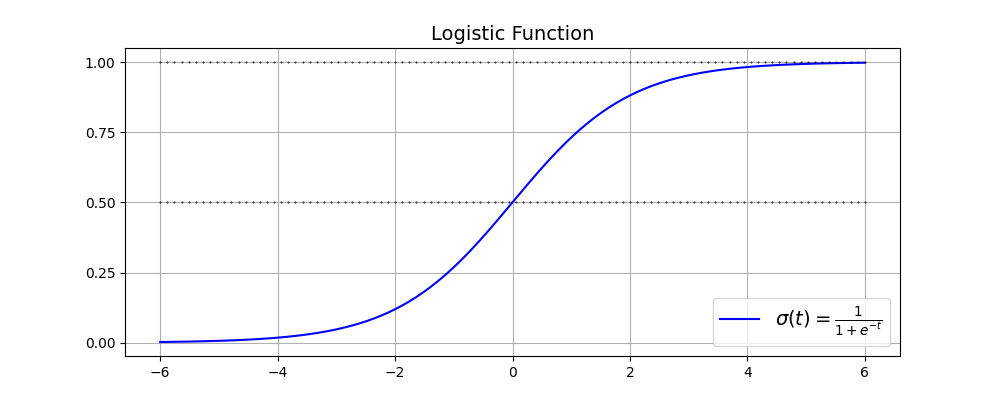

- [Logistic Regression](#logistic-regression)
  - [Estimated Probabilities](#estimated-probabilities)
  - [Training and cost function](#training-and-cost-function)
  - [Softmax Regression](#softmax-regression)


# Logistic Regression

Logistic Regression also called *logit regression* is commonly used to estimate the probability that an instance belongs to a particular class. If the estimated probability is greater than a given threshold $\to$ predict 1, otherwise $\to$ predict 0.

## Estimated Probabilities

Like Linear Regression, Logistic Regression computes a weighted sum of the input features (plus a bias term), but instead of outputting the result directly like linear regression, it outputs the *logistic* of this result.

$$
\hat{p} = h_\mathbf{\theta}(\mathbf{x}) = \sigma(\mathbf{\theta^T x}) \tag{4-13}
$$

$\sigma$ is sigmoid function (also called logistic function) that outputs a number between 0 and 1:

$$
\sigma(t) = \frac{1}{1 + \exp(-t)}
$$



Relationship between $\hat{p}$ and $\hat{y}$:

$$
\hat{y} = \begin{cases}
    0 & \text{if } & \hat{p} < 0.5 \\
    1 & \text{if } & \hat{p} \geq 0.5
\end{cases}
$$

Notice: $\sigma(t) < 0.5$ when $t < 0$ and $\sigma(t) \geq 0.5$ when $t \geq 0$, so a logistic regression model using the default threshold of $50\%$ probability predicts $1$ if $\mathbf{\theta^T x} \geq 0$ and $0$ if $\mathbf{\theta^T x} < 0$.

The score $t$ is often called the *logit*. The name comes from the fact that the logit function, defined as $\text{logit}(p) = \text{logit}(p / (1-p))$.

## Training and cost function

$$
c(\mathbf{\theta})=\begin{cases}\quad-\log(\widehat{p})\quad\text{if }y=1\\-\log(1-\widehat{p})\text{ if }y=0\end{cases} \tag{4-16}
$$

$-log(t)$ grows very large when $t$ approaches 0, so the cost function will be large if the model estimates a probability close to 0 for a **positive** instance, and it will also be large if the model estimates a probability close to 1 for a **negative** instance.

The cost function over the whole training set is the average cost over all training instances. It can be written in a single called the `log loss`. 

$$
J(\mathbf{\theta})=-\frac{1}{m}\Sigma_{i = 1}^{m}\Big[y^{(i)}log\Big(\widehat{p}^{(i)}\Big)+\Big(1-y^{(i)}\Big)log\Big(1-\widehat{p}^{(i)}\Big)\Big] \tag{4-17}
$$

There is `no known closed-form equation` to compute the value of $\theta$ that minimizes this cost function (like Normal equation). But this `cost function is convex`, so gradient descent is guaranteed to find a global minimum. The partial derivatives of the cost function with regard to the $j^{th}$ model parameter $\theta_j$:

$$
\frac\partial{\partial\theta_j}\mathrm{J}(\mathbf{\theta})=\frac1m\sum_{i = 1}^m\left(\sigma\Big(\mathbf{\theta}^\mathsf{T}\mathbf{x}^{(i)}\Big)-y^{(i)}\Big)x_j^{(i)}\right. \tag{4-18}
$$

## Softmax Regression

```python
Theta = np.random.randn((n_features, n_classes))
X # matrix (n_instances x n_features)
```

This logistic regression model can be generalized to support multiple classes directly, without having to train and combine multiple binary classifiers. This is called `softmax regression` or `multinomial logistic regression`.

When given an instance $\mathbf{x}$, the softmax regression model first computes a score $s_k(\mathbf{x})$ for each class $k$, then estimates the probability of each class by applying the *softmax function* to the scores.

`Softmax score` for class $k$:

$$
s_k(\mathbf{x})=\left(\mathbf{\theta}^{(k)}\right)^\intercal\mathbf{x} \tag{4-19}
$$

```python
s_k = X @ Theta
```

Each class has its own dedicated parameter vector $\theta^{(k)}$. All these vectors are typically stored as rows in a parameter matrix $\Theta$.

Once you have computed the score of every class for the instance $\mathbf{x}$. You can estimate the probability $\hat{p_k}$ that the instance belongs to class $k$ by running the scores through `the softmax function`:

$$
\widehat{p}_k=\sigma(\mathbf{s}(\mathbf{x}))_k=\frac{\exp\left(s_k(\mathbf{x})\right)}{\Sigma_{j = 1}^K \exp\left(s_j(\mathbf{x})\right)} \tag{4-20}
$$

```python
def softmax_function(logits):
    return np.exp(logits) / np.exp(logits).sum(axis = 1, keepdim = True)
```

Just like logistic regression classifier, by default the softmax regression classifier predicts the class with `highest probability`:

$$
\widehat{y}=\underset{k}{\operatorname*{argmax}} \sigma(\mathbf{s}(\mathbf{x}))_k=\underset{k}{\operatorname*{argmax}} s_k(\mathbf{x})=\underset{k}{\operatorname*{argmax}} \left(\left(\mathbf{\theta}^{(k)}\right)^{\mathsf{T}}\mathbf{x}\right) \tag{4-21}
$$

```python
y_hat = softmax_function(logits).argmax(axis = 1)
```

`Cross entropy cost function`:

$$
J(\boldsymbol{\Theta})=-\frac{1}{m}\Sigma_{i = 1}^m\Sigma_{k = 1}^Ky_k^{(i)}\mathrm{log}\Big(\widehat{p}_k^{(i)}\Big) \tag{4-22}
$$

```python
(- y_valid * np.log(y_hat + epsilon)).sum(axis = 1).mean() # add epsilon to avoid log(0) situation
```

`The gradient vector of this cost function`:

$$
\nabla_{\mathbf{\theta}}(k) J(\mathbf{\Theta})=\frac{1}{m}\sum_{i=1}^{m}\Big(\widehat{p}_{k}^{(i)}-y_{k}^{(i)}\Big)\mathbf{x}^{(i)} \tag{4-23}
$$

```python
 gradients = 1/m * X.T @ (y_hat - y_valid)
```

