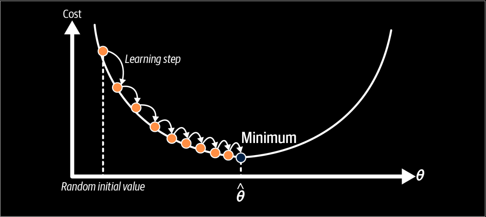
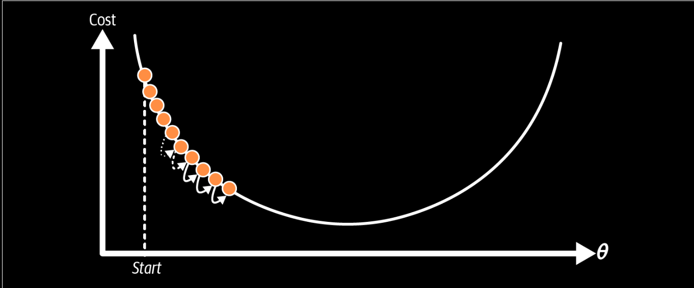
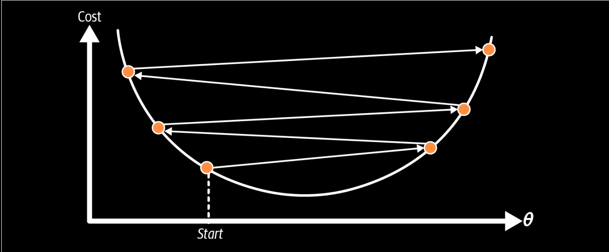
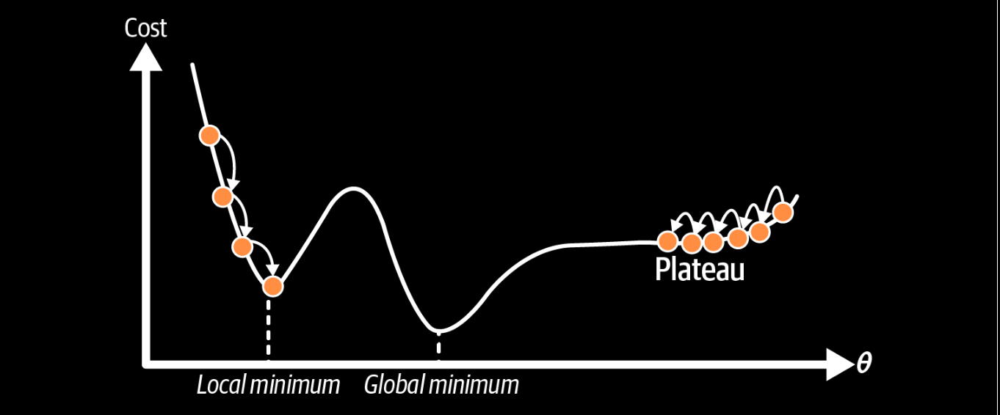
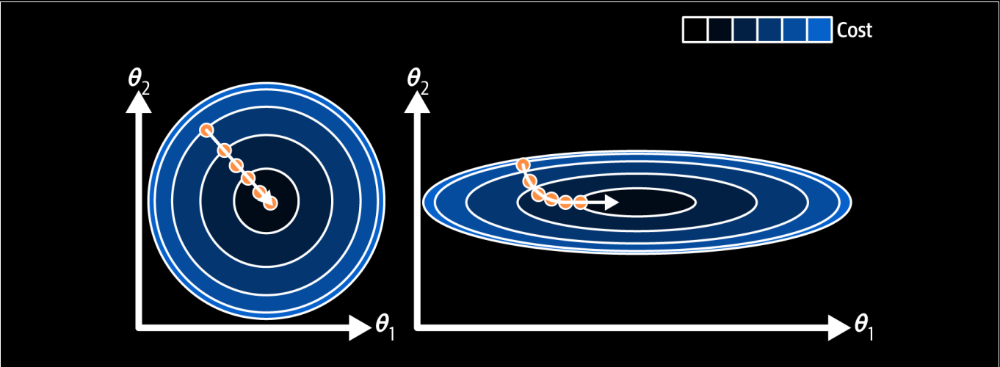
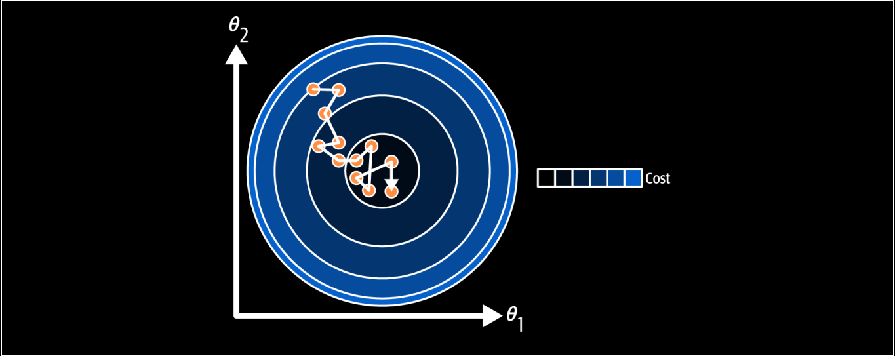

## Gradient Descent

*Gradient descent* is a generic optimatimazion algorithm of finding optimal solution to a wide range of problems. The general idea is to tweak parameters iteratively in order to optimize the cost function.



An important parameter in gradient descent is the size of the steps, determined by *learning rate* hyperparameter. If the *learning rate* is too small, then the algorithm will have to go through many iterations to converge.



In other case, if the learning rate is too hight, you might jumps across the valley and end up on the other side. This might make the algorithm diverge.



Additionally, not all cost function look like nice, regular bowls. There may be holes, ridges, plateaus, and all sorts of irregular terrain. Making convergence to the minium difficult. Look at below picture which shows the two main challenges with gradient descent. If the random initialization starts the algorithm on the left, then it will converge to a local minimum, which is not a global minimum. If it start on the right, then it will take very long time to cross the plateau. And if you stop too early, you will never reach the global minimum.



Fortunately, the MSE cost function for a linear regression model happens to be a *convex function*, which means that if you pick any two point on a curve, the line segment joining them is nerve below the curve. This implies that there are no local minima, just one global minimum.

When use Gradient Descent we should make features in the same scale. The picture below behave that:
- On the left, features are in the same scale, the algorithm straight toward the minimum.
- On the right, features are not in the same scale, it still reach the minimum but it will take a long time.



Training model means searching for a combination of model parameters that minimizes the cost function.

## Batch Gradient Descent

Equation 4-5: Partial derivatives of the cost function

$$
\frac\partial{\partial\theta_j}\mathrm{MSE}(\mathbf{\theta})=\frac2m\sum_{i=1}^m\left(\mathbf{\theta}^\mathsf{T}\mathbf{x}^{(i)}-y^{(i)}\right)x_j^{(i)} \tag{4-5}
$$

Instead of computing these partial derivatives individually, can use Equation 4-6 to compute them all in one go. The gradient vector, noted $\nabla_\mathbf{\theta} MSE(\mathbf{\theta})$ contains all the partial derivatives of the cost function:

$$
\nabla_{\mathbf{\theta}}{MSE}(\mathbf{\theta})=\begin{pmatrix}\dfrac{\partial}{\partial\theta_0}{MSE}(\mathbf{\theta})\\\\\dfrac{\partial}{\partial\theta_1}{MSE}(\mathbf{\theta})\\\vdots\\\dfrac{\partial}{\partial\theta_n}{MSE}(\mathbf{\theta})\end{pmatrix}=\dfrac{2}{m}\mathbf{X}^{\top}(\mathbf{X}\mathbf{\theta}-\mathbf{y})
$$

>[!note] Faster
>
>Gradient descent scales well with the number of features; training a linear regression model when there are hundreds of thousands of features is much faster using gradient descent than using Normal equation or SVD decomposition.

Once you have the gradient vector which points uphill, just go to opposite direction to go downhill. This means subtracting $\nabla_\mathbf{\theta} MSE (\theta)$ from $\mathbf{\theta}$. Multiply the gradient vector with $\eta$ to determine the size of the downhill step. (Equation 4-7)

$$
\mathbf{\theta}^{(\text{next step})}=\mathbf{\theta}-\eta\nabla_\mathbf{\theta}\text{MSE}(\mathbf{\theta})
$$

```python
eta = 0.1 # learning rate
n_epochs = 1000  # number of epochs
m = len(X_b) # number of instances

np.random.seed(42)
theta = np.random.randn(2, 1) # random initialization

for epoch in range(n_epochs):
    gradients = 2 / m * X_b.T @ (X_b @ theta - y)
    theta = theta - eta * gradients

theta
```

```output
array([[4.21509616],
       [2.77011339]])
```

The learning rate is 0.1 and looped through 1000 iters. What if you had used a different learning rate. Figure below shows the first 20 steps of gradient descent using three different learning rates.


On the left, the learning rate is too small, then it take many time to converge. On the right, the learning rate is too high, then it jump over the converge points. In the middle, the learning rate is proper.

To find a good learning rate, can use Grid Search. However you may want to limit the number of epochs so that grid search can eliminate models that take too long to converge.

A simple way to solve the epochs problems is set a very large number of epochs but to interrupt the algorithm when the gradient vector is too tiny, when its norm becomes smaller than a tiny number ($\epsilon$) because this happens when gradient descent has reached the minimum.

## Stochastic Gradient Descent

The main problems of Batch Gradient Descent is it uses the whole tanning set to compute the gradient every step, which makes it very slow when the training set is too large. At the opposite extreme, *stochastic gradient descent* picks a random instance in the training set at every step and computes the gradients based only on that single instance.

On the other hand, due to its stochastic (random) nature, this algorithm is much less regular than batch gradient descent. instead of gently decreasing until it reaches the minimum, the cost function will bounce up and down, decreasing only on average. Over time it will end up very close to the minimum, but once it gets there it will continue to bounce around, never settling down (Figure below). Once the algorithm end, the final parameter will be good but not optimal.



Therefore, randomness is good to escape from local optima, but bad because it means that the algorithm can be never reaches to the minimum. One solution is gradually reduce the learning rate. The steps start out large (will help escape from local optima), then get smaller to settle to good minimum. But if you reduce to quickly, algorithm may get stuck in a local minimum. If the learning rate reduced too slowly, it may jump around the minimum for a long time and end up suboptimal solution if you half training too early.

Note that since instances are picked randomly, some instances may be picked several times per epoch, while others may not be picked at all. If want the algorithm goes through every instances at each epoch, another approach is to shuffle the training set. But this approach is more complex, and it generally does not improve the result.

>**Note:**
>
>When using the stochastic gradient descent, the training instances must be independent and identically distributed (IID) to ensure that the parameters get pulled toward the global minimum, on average. A simple way to ensure this is to shuffle the instances during training (pick each instance randomly, or shuffle training set at the beginning of each epoch).

