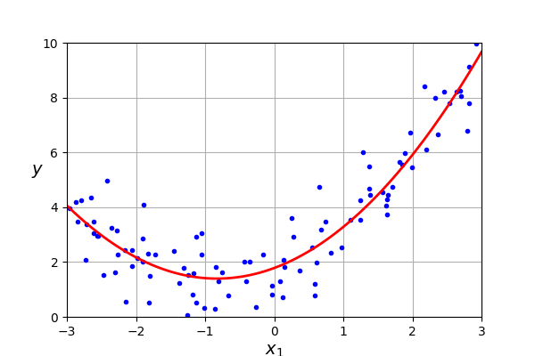
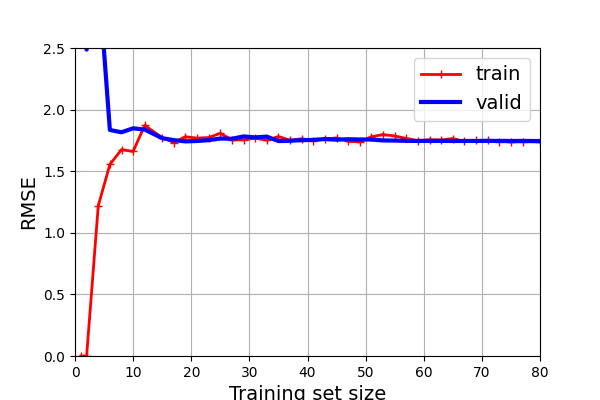
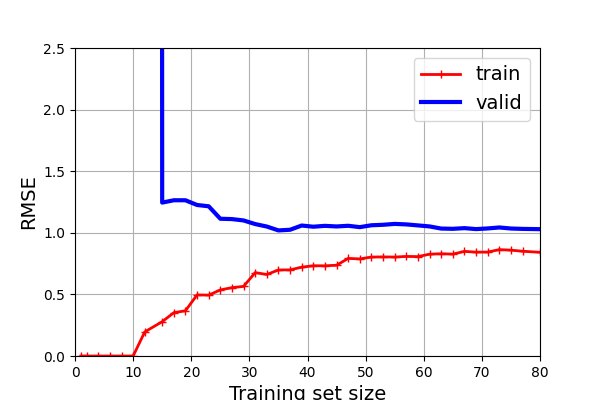

- [Polynomial Regression](#polynomial-regression)
- [Learning Curve](#learning-curve)
- [The Bias/Variance Trade-Off](#the-biasvariance-trade-off)

## Polynomial Regression

If the dataset is nonlinear. You can use Polynomial Regression to add powers of each feature as new features, then train a linear model on this extended set of features.

When there are multiple features, polynomial regression is capable of finding relationships between features, which is something a plain linear regression model cannot do. This is made possible by the fact that *PolynomialFeatures* also adds all combinations of features up to the given degree. For example, if there are two features $a$ and $b$, *PolynomialFeatures* with `degree = 3` would not only add the features $a^2, a^3, b^2, b^3$, but also the combinations $ab, a^2 b, b^2 a$   

## Learning Curve

If perform high-degree polynomial regression, you likely fit the training set much better than the plain linear regression. For example, figure below applies 300-degree polynomial model to preceding training data and compare with second-degree polynomial. 

This high-degree polynomial regression model is severely overfitting the training data, while the linear model is underfiting it. The model that is generalize best in second-degree mode.

Another way to tell your model is underfiting or overfitting is look at the *learning curve*, which are plots of model's training error and validation error as a function of the training iteration: just evaluate the model at regular intervals on both the training set and the validation set, and plot the results. 

The figure above is the learning curve of the Linear Regression. This model is underfiting. Firstly, look at the training error. When there are just one or two instances in the training set, the model can fit perfectly. But as new instances are added to the training set, it becomes impossible for the model to fit the training data perfectly, both because the data is not linear. So the error on the training data goes up until it reaches a plateau, at which point adding new instances to the training set doesn't make the average error better or worse. 

Secondly, look at the validation error. When there are just few instances, it is incapable of generalizing properly, which is why the validation error is initially quite large. Then, the model is shown more instances, it learns, and thus the validation error slowly goes down.

`These learning curves are typical of a model that's underfitting. Both curves have reached a plateau; they are close and fairly high.`

The learning curves figure below is Polynomial Regression with degree = 10.

These learning curves look a bit like the previous one, but there are two very importance differences.
- The error on training set is much lower than before.
- There is a gap between the curves. This mean the model performs significantly better on the training set than on the validation set, which is hallmark of an overfitting model. If you used a much large training set, the two curves would continue to get closer.

## The Bias/Variance Trade-Off

The model's generalization error can be expressed as the sum of three very different errors:

- **Bias**:

This part of the generalization error is due to wrong assumption, such as assuming that the data is leaner when it actually quadratic (second-degree). A high-bias model is most likely to underfit the training data.

- **Variance**:

This part is due to the model's sensitivity to small variations in the training data. A model with many degrees of freedom (such as high-degree polynomial model) is likely to have high variance and thus overfit the training data. 

- **Irreducible error**:

This part is due to the bad data. The only way to reduce this part is clean up dataset.

Increasing a model's complexity will typically increase its variance and reduce its bias.

Conversely, reducing a model's complexity will increase its bias and reduce its variance.

