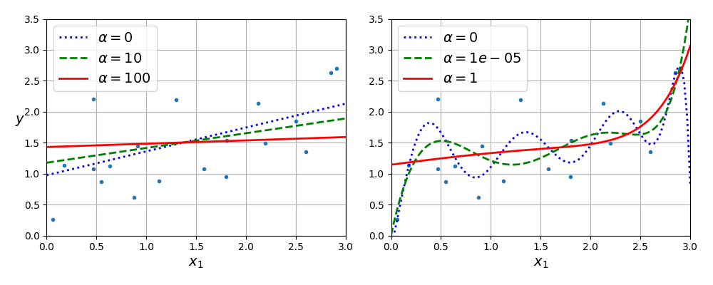
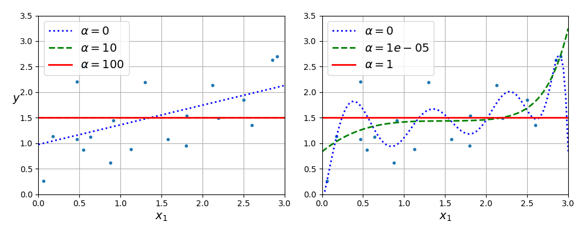
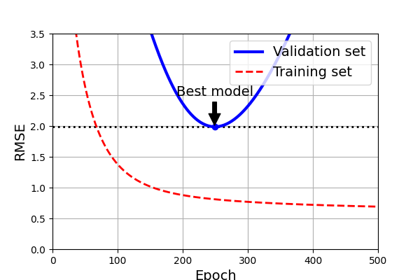
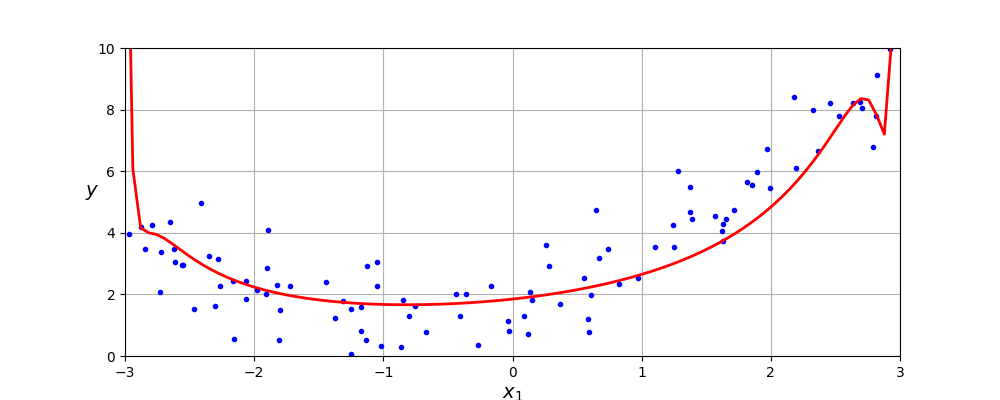

- [Regularized Linear Model](#regularized-linear-model)
- [Ridge Regression](#ridge-regression)
- [Lasso Regression](#lasso-regression)
- [Elastic Net Regression](#elastic-net-regression)
- [Early Stopping](#early-stopping)


## Regularized Linear Model

A good way to reduce overfitting is to regularize the model (i.e., to constrain it). the fewer degrees of freedom it has, the harder it will be for it to overfit the data. A simple way to regularize a polynomial model is to reduce the number of polynomial degrees.

For a linear model, regularization is typically achieved by constraining the weights of the model. Let's look at `Ridge Regression`, `Lasso Regression`, `Elastic Net Regression`.

## Ridge Regression

A regularization term equal to $\displaystyle{ \frac{\alpha}{m}\sum_{i=1}^n \theta^2_i }$ is added to the MSE. This forces the learning algorithm to not only fit the data but also keep the model weights as small as possible.

>[!Note] Note
>
>The regularization term should only be added to the cost function during training. Once the model is trained, you want to use the unregularized MSE (or the RMSE) to evaluate the model's performance.

The $\alpha$ parameter controls how much you want to regularize the model. If $\alpha = 0$, then ridge regression is just linear regression. If $\alpha$ is very large, then all weights end up very close to zero and result is a flat line going through the data's mean. Ridge Regression's Equation.

$$
J(\mathbf{\theta}) = \text{MSE}(\mathbf{\theta}) + \frac{\alpha}{m} \sum_{i=1}^n \theta^2_i \tag{4-8} 
$$

>[!Note] Note
>
>- The bias term $theta_0$ is not regularized (the sum is from $i=1$ to $i=n$). If we define $\mathbf{w} = [\theta_1, \dotsb, \theta_n]$ then the regularization is equal to $\displaystyle{ \alpha\left(\|\mathbf{w}\|_2\right)^2 }$, where $\|\mathbf{w}\|_2$ represents the $\ell_2$.
>
>- It is important to scale the data (`StandardScaler`) before performing ridge regression, as it is sensitive to the scale of the input features. This is true of most regularized models.



Figure above shows several ridge models that were trained on some very noisy linear data using different $\alpha$. On the left, plain ridge models are used leading to linear predictions. On the right, the data is first expanded using `PolynomialFeatures = 10`. If increasing $\alpha$, the model's variance is reduced but its bias is increased.

As linear regression, Ridge regression can be performed either by computing a closed-form or by performing gradient descent. The pros and cons are the same. Equation 4-9 shows the closed-form solution, where $\mathbf{A}$ is the $(n+1) \times (n+1)$ identify matrix, except with a $0$ in the top-left cell, corresponding the bias term.

$$
\hat{\mathbf{\theta}} = \mathbf{(X^T X + \alpha A)^{-1} X^T y} \tag{4-9}
$$

```python
from sklearn.linear_model import Ridge

ridge_reg = Ridge(alpha = 0.1, solver = "cholesky")
ridge_reg.fit(X, y)
ridge_reg.predict([[1.5]])

___
array([[1.55325833]])
```

```python
sgd_reg = SGDRegressor(penalty = 'l2', alpha = 0.1/m, tol = None, max_iter = 1000, eta0 = 0.01, random_state = 42)
sgd_reg.fit(X, y.ravel())
sgd_reg.predict([[1.5]])
___
array([[1.55325833]])
```
>Note
>
>The `RidgeCV` class also perform ridge regression, but it automatically tunes hyperparameters using Cross Validation like using GridSearchCV but faster. Several other estimators (mostly linear) also have efficient CV variants, such as `LassoCV`, `ElasticNetCV`.

## Lasso Regression

Another regularized version of linear regression: just like Ridge regression, it add a regularization term to the cost function, but it uses the $\ell_1$ norm of the weight vector instead of $\ell_2$ norm. Notice that the $\ell_1$ norm is multiplied by $2\alpha$ whereas the $\ell_2$ norm was multiplied by $\alpha / m$ in ridge regression. Lasso Regression's cost function below:

$$
J(\mathbf{\theta})=\text{MSE}(\mathbf{\theta})+2\alpha\Sigma_{{i=1}}^{n}|\theta_{i}| \tag{4-10}
$$

Figure below shows the same thing as the Ridge Regression figure but replace the Ridge model with Lasso model.



## Elastic Net Regression

Elastic Net regression is a middle ground between ridge regression and lasso regression. The regularization term is a weighted sum of both ridge and lasso's regularization terms, and you can control the mix ratio $r$. When $r=0$, elastic net is ridge, and when $r=1$, it is lasso. Elastic Net's Equation:

$$
J(\mathbf{\theta})=\text{MSE}(\mathbf{\theta})+r\big(2\alpha\Sigma_{i = 1}^n|\theta_i|\big)+\Big(1-r\Big)\Big(\frac{\alpha}{m}\Sigma_{i = 1}^n\theta_i^2\Big)
$$

So we should have at least a little bit of regularization, so generally we should `avoid plain linear regression`. `Ridge is a good default`, but if you suspect that only `a few features are useful`, you should prefer `lasso or elastic net` because they tend to `reduce the useless` features's weight down to zero. Finally, elastic net is preferred over lasso because lasso may behave unstable when the `number of features is greater than the number of instances` or when `several features are strongly correlated`.

## Early Stopping

A very different way to regularize iterative learning algorithms such as gradient descent is to stop training as soon as the validation error reaches a minimum. This is called *early stopping*. Figure below shows a complex model (in this case, a high-degree polynomial regression model)

The image below of best model early stopping.





