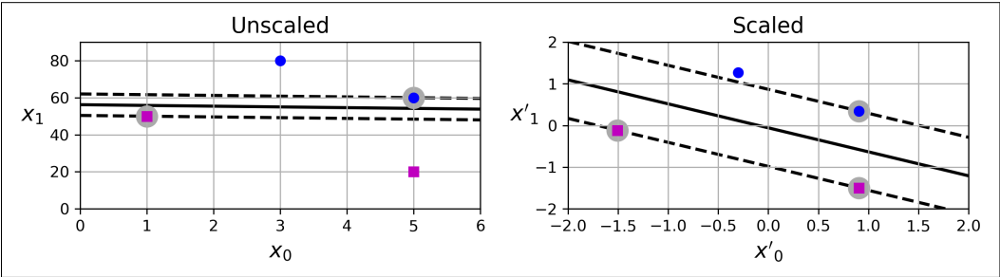
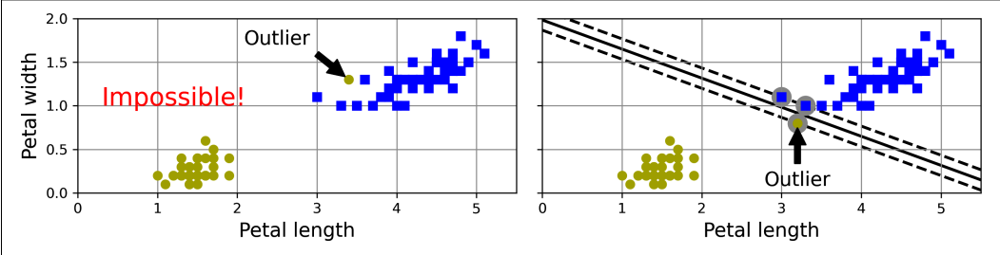
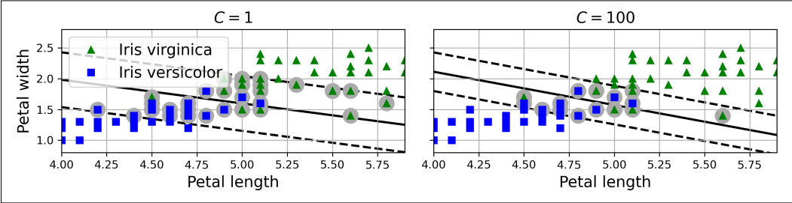
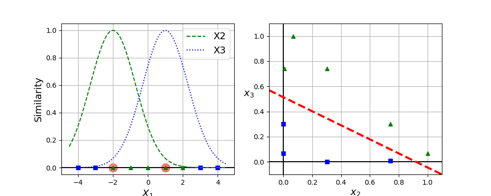
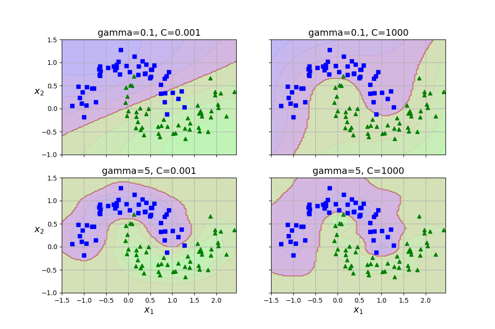
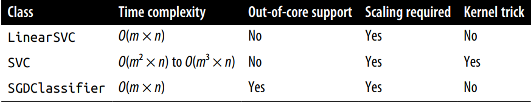
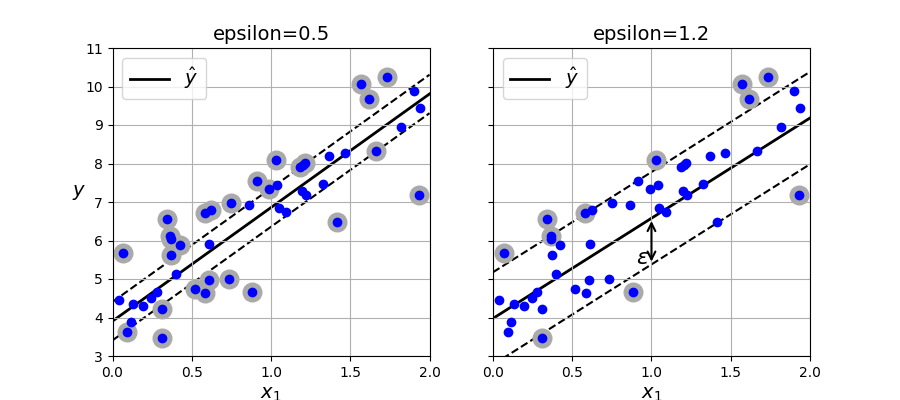

- [Introduce](#introduce)
- [Linear SVM Classification](#linear-svm-classification)
- [Soft Margin Classification](#soft-margin-classification)
- [Nonlinear SVM Classification](#nonlinear-svm-classification)
- [Polynomial Kernel](#polynomial-kernel)
- [Similarity Features](#similarity-features)
- [Gaussian RBF Kernel](#gaussian-rbf-kernel)
- [SVM Classes and Computational Complexity](#svm-classes-and-computational-complexity)
- [SVM Regression](#svm-regression)


## Introduce

SVM is a powerful and versatile machine learning model, capable of performing `linear` or `nonlinear classification`, `regression`, and even `novelty detection`. SVMs shine with small to medium-sized nonlinear datasets (i.e., hundreds to thousands of instances), `especially for classification tasks`. 

## Linear SVM Classification

`Linear separable` is the two classes can clearly be separated easily with a straight line. You can think of an SVM classifier as fitting the widest possible street between the classes SVM is also called `large margin classification`. 

SVMs are sensitive to the feature scales.



## Soft Margin Classification

If we strictly impose that all instances `must be off the street` and `on the correct side`, this is called `hard margin classification`. There are two main issues with hard margin classification:

- It `only works` if the data is `linearly seperable`.
- It is sensitive to outliers.



To avoid theses issues, we need to use a **more flexible model**. The objective is to find a good balance between keeping the street as large as possible and limiting the `margin violations` (i.e., instances that end up in the middle of the street or even on the wrong side). 

When creating SVM model using Scikit-learn, you can specify hyperparameter $C$. If $C$ is low your model is on the left, if $C$ is high your model is on the right side.



Reducing $C$ makes the street larger, but is also leads to more margin violation. In oder words, reducing $C$ `results in more instances supporting the street`, so there's less `rick of overfitting`. But if you `reduce it too much`, then model is `underfitting`. 

Summary, reducing $C$ when model is overfitting.

## Nonlinear SVM Classification

When the datasets are not even close to being linearly separable. One approach to handling nonlinear datasets is to add more features, such as polynomial features. 


## Polynomial Kernel

Adding polynomial features is simple to implement and can work great with all sorts of machine learning algorithms (not just SVMs). That said, at a `low polynomial degree` this method `cannot deal with very complex datasets`, and with `high degree` it creates a huge number of features making `the model too slow`.

Fortunately, when `using SVMs` you can apply an almost miraculous mathematical technique called the `kernel trick`. The kernel trick `makes it possible to get the same result` as if you `had added many polynomial features`, even with a very high degree, `without actually having to add them`.

```python
from sklearn.svm import SVC

poly_kernel_svm_clf = make_pipeline(
    StandardScaler(),
    SVC(kernel = "poly", degree = 3, coef0 = 1, C = 5)
)
```

Code above is SVM polynomial degree 3's implement by kernel trick.


If model overfitting you can try reduce the polynomial degree. Conversely, if it underfitting, you can try increasing it.

The hyperparameter `coef0` controls how much the model is `influenced` by `high-degree terms` versus `low-degree terms`.

## Similarity Features

Another technique to tackle nonlinear problems is to add `features computed using a similarity function`, which measures how much each instances resembles a particular `landmark`. For example, let's take the 1D dataset from earlier and add two landmarks to it at $x_1 = -2$ and $x_2 = 1$. Next, we will define the similarity function to be the `Gaussian RBF` with $\gamma = 0.3$. This is a bell-shaped function varying from $0$ (very far from the landmark) to $1$ (at the landmark).



You may wonder how to select the landmarks. The simplest approach is to create a landmark at the location of each and every instance in the dataset.

## Gaussian RBF Kernel

Just like the polynomial features method, the similarity features method can be useful with any ML algorithm, but it may be `computationally expensive` to `compute all the additional features` (especially on large training sets). Once again, `kernel trick does its SVM magic`, making it possible to `obtain a similar result` as if you `had added many similar features`, but `without actually doing so`.

Gamma hyperparameter $\gamma$ make the `bell-shaped curve narrower if it large`. Conversely, a small $\gamma$ value makes the `bell-shaped curve wider`. So $\gamma$ acts like a regularization hyperparameter. If your model is `overfitting`, you should `reduce` $\gamma$; if it `underfitting`, you should `increase` $\gamma$. 



## SVM Classes and Computational Complexity



## SVM Regression

To use SVMs for regression instead of classification, the trick is tweak the objective: instead of trying to fit the largest possible street between two classes while limiting margin violations. SVM regression tries to fit as many instances as possible on the street while limiting margin violations. The width of the street is controlled by a hyperparameter $\epsilon$.



Reducing $\epsilon$ increases the number of support vectors, which regularizes the model. Moreover, if you add more training instances within the margin, it will not affect the model's prediction; thus, the model is said to be $\epsilon$-insensitive.

