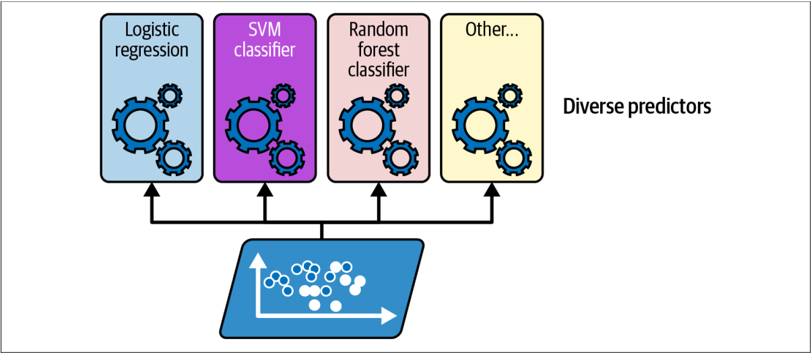
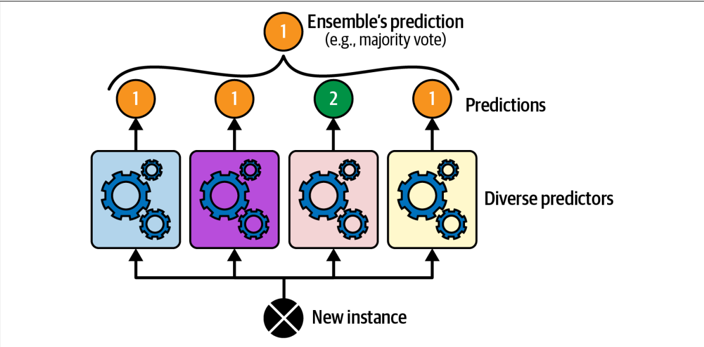
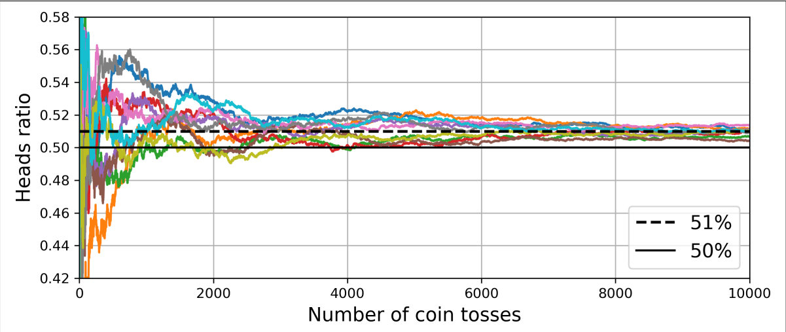
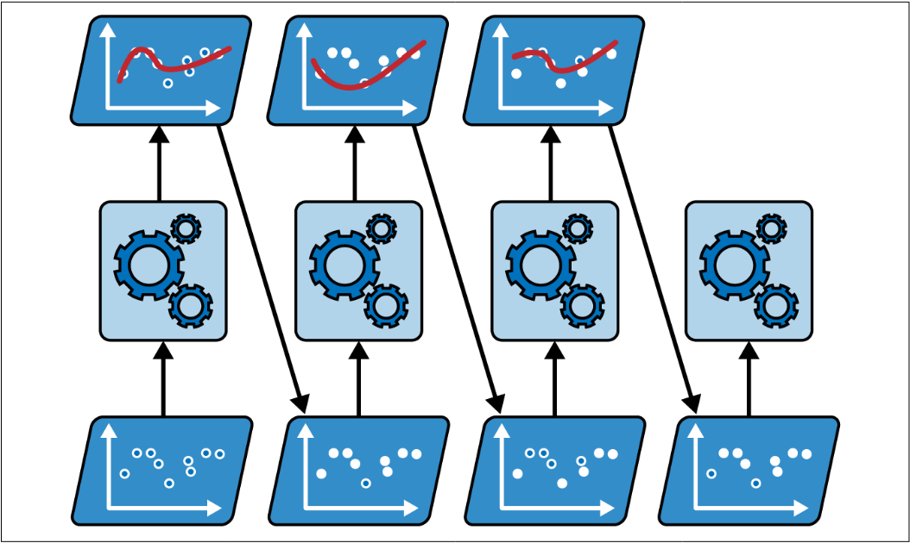
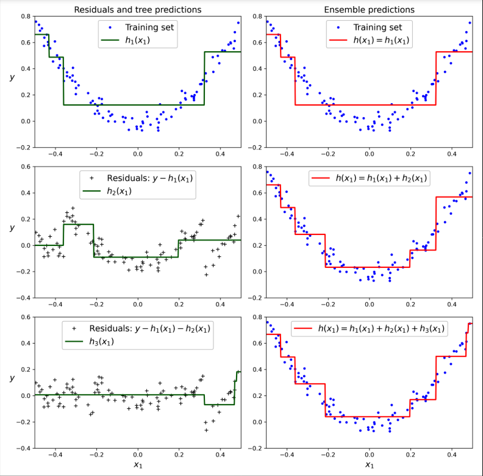

- [Ensemble Learning and Random Forests](#ensemble-learning-and-random-forests)
  - [Introduce](#introduce)
  - [Voting Classifiers](#voting-classifiers)
  - [Bagging and Pasting](#bagging-and-pasting)
    - [Random Patches and Random Subspaces](#random-patches-and-random-subspaces)
  - [Random Forest](#random-forest)
  - [Random Forest](#random-forest-1)
  - [Features Importance](#features-importance)
  - [Boosting](#boosting)
    - [AdaBoost](#adaboost)
  - [Gradient Boosting](#gradient-boosting)


# Ensemble Learning and Random Forests

## Introduce

Suppose you pose a complex question to thousands of random people, then aggregate their answers. In many cases you will find that this aggregated answer is better than an expert’s answer. This is called the `wisdom of the crowd`. 

Example: Train a `group of decision tree classifiers`, each on a different random subset of the training set. You `take the predictions of all the individual trees`, and the `class gets most votes` is the ensemble's prediction.

## Voting Classifiers

When you have trained a few classifiers that each on achieving about 80% accuracy. A simple way to create an even better is aggregate the predictions of each classifiers: the class which gets the most votes is the ensemble prediction. This is called `hard voting`. 





The `voting classifier` often achieves a `higher accuracy than` the `best classifier` in the ensemble. In fact, even if each classifier is a `weak learner` (low accuracy), the ensemble can still be a `strong learner` (achieve high accuracy), as long as you provide a `sufficient number of weak learners` in the ensemble and they are `sufficiently diverse`.

Example: You have a slightly biased coin that has a `51% chance of coming up with heads and 49% coming up with tails`. If you toss it `1000 time`, you will get `more or less 510 heads and 490 tails`, and hence a majority of heads. If you toss the coin continuously, the probability of obtaining a majority of head will increase. It's due to `law of large number`. The `ratio of heads` gets `closer` and closer to the `probability of head` (51%).



Now that, suppose you build an ensemble containing `1000 classifiers` that are `individually correct only 51% of the time`. If you predict the majority `voted class`, you can hope for `up to 75% accuracy`. But it `only happens` if all classifiers are `perfectly independent` (Unless, they are likely to make the same types of errors). Because of that, we will train them `using very different algorithms`.

Soft voting is averaged over all the individual classifiers probability predictions (If all the classifiers have `predict_proba()` method). It often achieves higher performance than hard voting because it gives more weight to highly confident votes.

## Bagging and Pasting

Bagging is use the sam training algorithm for every predictor but train them on different random subsets of the training set.

Pasting is train many predictor in the whole training set.

Once all predictors are trained, the ensemble can make a prediction for a new instance by simply aggregating the predictions of all predictors.

### Random Patches and Random Subspaces

The Bagging Classifier class supports sampling the feature. Sampling is controlled by two hyperparameters: `max_features` and `bootstrap_features`. They work the same way as `max_samples` and `bootstrap` but features sampling instead of instances sampling. This technique is particularly useful when you are deal with high-dimensional inputs. 

`Random patches method` is `sampling both` training instances and features.

`Keeping` all training `instances` but `sampling features` is called the `random subspaces method`.

## Random Forest

## Random Forest

Random forest is an ensemble of decision trees, generally trained via the bagging method (sometimes pasting), typically with `max_samples` set to the size of training set. `Instead of` building a `BaggingClassifier` and passing it a Decision Tree, you can `use RandomForestClassifier` for `convenience` and `optimization` for `Decision Tree`.

The Random Forest has `all the hyperparameters of a DecisionTreeClassifier` (to control how trees are grown), plus `all the hyperparameters of a BaggingClassifier` to control the ensemble itself.

The random forest algorithm introduces `extra randomness when growing tree`, `instead of searching for the very best feature` when splitting a node, it `searches for the best feature among random subset of features`. By default, it samples $\sqrt{n}$ features ($n$ is the total number of features).

## Features Importance 

The random forest make it easy to measure the relative importance of each feature. Scikit-learn measures a features's importance by looking at how much the tree nodes that use that feature reduce impurity on average, across all trees in the forest. Can use `feature_importances_` of random forest class.

The image shows importance of features of the MNIST dataset, easy to see the center of picture is the most important place to predict a digit.

## Boosting

Boosting refers to any ensemble methods that can `combine several weak learners` into `strong learners`. The general idea of most boosting methods is to `train predictors sequentially`, each trying to `correct its predecessor`.

Most popular boosting methods are `AdaBoost` (adaptive boosting) and `Gradient Boosting`.

### AdaBoost

The mainly idea to `correct predicts's predecessor` is to `pay bit more attention` to `training instances that the predecessor underfit`. 



Each `instance weight` $w^{(i)}$ is `initially set` to $1/m$. A first predictor is trained, and its `weighted error rate` $r_i$ is computed on the training set. This sequential learning technique has some `similarities` with `gradient descent`, except that instead of `tweaking a single predictors parameters` to `minimize a cost function`, Ada boost `adds predictors to the ensemble`, making it `better`. 

$$
r_{j}=\sum_{{\begin{array}{c}i=1\\\widehat{y}_{j}^{(i)}\neq y^{(i)}\end{array}}}^{m}w^{(i)}\quad\mathrm{where~}\widehat{y}_{j}^{(i)}\text{ is the }j^{{\mathrm{th}}}\text{ predictor's prediction for the }i^{{\mathrm{th}}}\text{ instance} \tag{7-1}
$$

The `predictor's weight` $\alpha_j$ is `computed using Equation 7-2`, in this: $\eta$ is the `learning rate` hyperparameter (default = 1). `The more accurate` the predictor is, `the higher its weight` will be. If it just `guessing randomly`, then its weight will be `close to 0`. However, if it is `often wrong` $\to$ its weight `will be negative`.

$$
\alpha_j=\eta\log\frac{1-r_j}{r_j} \tag{7-2}
$$

Next, the AdaBoost updates the instance weights, using Equation 7-3 which boost the weights of the misclassified instances.

$$
\text{for } i=1,2,\cdots,m\\w^{(i)}\leftarrow\begin{cases}w^{(i)}&\text{if } \widehat{y_j}^{(i)}=y^{(i)}\\w^{(i)}\exp\left(\alpha_j\right)&\text{if } \widehat{y_j}^{(i)}\neq y^{(i)}\end{cases} \tag{7-3}
$$

Then `all instance weights` are `normalized` (divided by $\sum_{i=1}^m w^{(i)}$)

Finally, `process will be repeat` and it `stops when` the desired number of predictors is reached (it `reaches n_estimators`), or when a `prefect predictor is found`.

## Gradient Boosting

Just like Adaboost, gradient boosting works by `sequentially adding predictors to an ensemble`, each one correcting its predecessor. `Instead of tweaking instance weight`, it tries to `fit the new predictor` to the `residual errors` made by previous predictor.

Example: using the `decision tree as the base predictors`; this is called gradient tree boosting, or `gradient boosted regression trees` (`GBRT`)

```python
import numpy as np
from sklearn.tree import DecisionTreeRegressor

np.random.seed(42)
X = np.random.rand(100, 1) - .5
y = 3 * X[:, 0] ** 2 + 0.05 * np.random.randn(100) # y = 3x^2 + Gaussian noise

tree_reg1 = DecisionTreeRegressor(max_depth=2, random_state=42)
tree_reg1.fit(X, y)

## Next, we train a second Decision tree on the residual error made by first predictor.
y2 = y - tree_reg1.predict(X)
tree_reg2 = DecisionTreeRegressor(max_depth=2, random_state=42)
tree_reg2.fit(X, y2)

# Then, we will train the third predictor on the residual error made by second predictor. 
y3 = y2 - tree_reg2.predict(X)
tree_reg3 = DecisionTreeRegressor(max_depth=2, random_state=42)
tree_reg3.fit(X, y3)

# let make prediction on a new instance
X_new = np.array([[-0.4], [0], [0.5]])
print(sum(tree.predict(X_new) for tree in (tree_reg1, tree_reg2, tree_reg3)))
_____________________________________________
array([0.49484029, 0.04021166, 0.75026781])
```



Figure above shows the predictions of these trees on the left column, and the ensemble's predictions in the right column.

First row, there is only one tree, then on the both sides, it similar.

Second row, a new tree is trained on the residual errors of the first tree. On the right, the ensemble's prediction are equal to the sum of the predictions of the first two trees.

Can use Scikit-Learn GradientBoostingRegressor class to train GBRT ensembles more easily.

```python
from sklearn.ensemble import GradientBoostingRegressor

gbrt = GradientBoostingRegressor(max_depth=2, n_estimators=3, learning_rate=1.0, random_state=42)
gbrt.fit(X, y)
```


