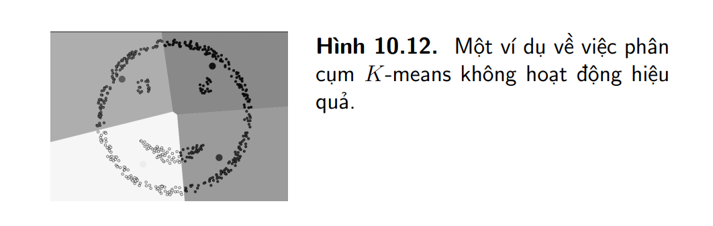

# Phân cụm K-means

## 1. Sơ lược

Thuật toán unsupervised-learning đơn giản. Thuật toán tên là phân cụm K-means(K-means clustering)

Trong thuật toán này ta không biết các labels của từng điểm dữ liệu. Mục đích là làm thế nào để phân dữ liệu thành các cụm (cluster) khác nhau sao cho trong cùng một cụm dữ liệu có tính chất giống nhau.

### **Ví dụ**

Một công ty muốn tạo ra chính sách ưu đãi cho khách hàng của họ dựa trên sự tương tác của khách hàng: số năm làm khách hàng, số tiền đã chi trả cho công ty, dộ tuổi, giới tính, nghề nghiệp,... Giả sử công ty có dữ liệu của khách hàng nhưng phân cụm thì thuật toán K-means sẽ giúp thực hiện công việc này. Sau khi phân cụm, nhân viên công ty có thể quyết định mỗi nhóm tương ứng với khách hàng nào.

Một nhóm / cụm có thể là tập hợp các điểm có vector đặc trưng gần nhau. Việc tính toán khoảng cách bằng Euclid đc sử dụng phổ biến.

## 2. Phân tích toán học

Mục đích của thuật toán: Từ dữ liệu đầu vào và số cụm cần tìm, xác định tâm mỗi cụm và phân dữ liệu vào các cụm tương ứng. Giả sử rằng mỗi điểm dữ liệu chỉ thuộc đúng 1 cụm.

Giả sử có $N$ điểm dữ liệu trong tập huấn luyện được ghép thành ma trận $\mathbf{X} = [\mathbf{x_1}, \mathbf{x_2}, \mathbf{x_3}, ..., \mathbf{x_N}] \in \mathbf{R^{d\times N}}$ và $K < N$ là số cụm cần được xác định trước. Ta cần tìm tâm các cụm $\mathbf{m_{1},m_{2},\dots,m_{K}}\in \mathbb{R}^{d\times 1}$ và nhãn của mỗi điểm dữ liệu. Mỗi cụm được đại diện bởi một nhãn, thường là các số tự nhiên từ $1$ đến $K$.

Với mỗi điểm dữ liệu $\mathbf{x_{i}}$, ta cần tìm nhãn $y_{i} = k$ của nó với $k \in \{1,2,3,\dots,K\}$. Nhãn của một điểm dữ liệu thường được biểu diễn dưới dạng vector hàng K phần tử $y_{i} \in \mathbb{R}^{1 \times K}$, trong đó các phần tử của $\mathbf{y_{i}} = 0$, trừ vị trí thứ $k = 1$. Cách biểu diễn này gọi là mã hóa *one-hot* (**one hot encoder**). Cụ thể, $y_{ij}=0, \forall j \neq k, y_{ik}=1$. Khi chồng các vector $\mathbf{y_{i}}$ lên nhau ta được ma trận nhãn $\mathbf{Y} \in \mathbb{R^{N \times K}}$. Phần tử $y_{ij}$ là phần tử hàng i cột j của $Y$ cũng là phần tử thứ $j$ của vector $\mathbf{y_{i}}$.

Điều kiện của $\mathbf{y_{i}}$ là:
$$y_{ij} \in \{0,1\}, \forall i, j; \ \ \sum_{j = 1}^K y_{ij} = 1 \tag{1}$$
Nghĩa là trong mỗi hàng thì chỉ có 1 phần tử = 1

### **2.1 Hàm mất mát và bài toán tối ưu**

Gọi $\mathbf{m_{k}} \in \mathbb{R}^d$ là tâm của cụm thứ $k$. Giả sử một điểm dữ liệu $\mathbf{x_{i}}$ được phân vào cụm k. Vector sai số nếu thay $\mathbf{x_{i}}$ bằng $\mathbf{m_{k}}$ là $(\mathbf{x_{i}} - \mathbf{m_{k}})$. Ta muốn vector này gần với vector không, tức là $\mathbf{x_{i}}$ gần với $\mathbf{m_{k}}$. Việc này thông qua tối thiếu bình phương khoảng cách Euclid $||\mathbf{x_{i}}-\mathbf{m_{k}} ||^2$. Hơn nữa, vì $\mathbf{x_{i}}$ được phân vào cụm $k$  nên $y_{ik} = 1$. Khi đó biểu thức khoảng cách được viết lại:
$$||\mathbf{x_{i}}-\mathbf{m_{k}}||^2 = y_{ik}||\mathbf{x_{i}}-\mathbf{m_{k}}||^2 = \sum_{j=1}^K y_{ij}||\mathbf{x_{i}}-\mathbf{m_{k}}||^2 \tag{2}$$

Như vậy, sai số trung bình cho toàn bộ dữ liệu là:

$$\mathcal{L}(\mathbf{Y,M})=\frac{1}{N}\sum_{i = 1}^N\sum_{j=1}^K y_{ij}||\mathbf{x_{i}}-\mathbf{m_{k}}||^2 \tag{3}$$
Trong đó $\mathbf{M = [m_{1}, m_{2}, \dots, m_{K}]} \in \mathbb{R}^{d \times K}$ là ma trận tạo bởi $K$ tâm cụm. hàm mất mát trong bài toán phân cụm **K-means** là $\mathcal{L}(\mathbf{Y,M})$ với điều kiện ràng buộc như $(1)$. Để tìm tâm cụm và cụm tương ứng của mỗi điểm dữ liệu, ta cần giải bài toán tối ưu có ràng buộc:

$$\mathbf{Y,M}=Y, M = \arg\min_{Y,M} \frac{1}{N}\sum_{i = 1}^N\sum_{j=1}^K y_{ij}||\mathbf{x_{i}}-\mathbf{m_{k}}||^2$$
$$\text{thỏa mãn:}\  y_{ij} \in \{0, 1\}, \forall i,j;\ \ \  \sum_{j = 1}^K y_{ij} = 1 \tag{4}$$

### **2.2 Thuật toán tối ưu hàm mất mát**

Bài toán $(4)$ là một bài toán khó tìm điểm tối ưu vì có thêm điều kiện ràng buộc. *Bài toán này thuộc loại mix-integer programming (điều kiện biến là số nguyên) - là loại rất khó tìm nghiệm tối ưu toàn cục.* Phương pháp giải tìm nghiệm gần đúng: ==giải xen kẻ== $\mathbf{Y}$ và $\mathbf{M}$ khi biến còn lại được cố định cho đến khi ==hàm mất mát hội tụ==.

#### Cố định $\mathbf{M}$, tìm $\mathbf{Y}$

*Đã tìm được các tâm cụm, tìm vector nhãn sao cho hàm mất mát đạt min*
Khi tâm cụm được cố định, bài toán tìm nhãn được chia nhỏ thành tìm nhãn cho từng điểm dữ liệu $\mathbf{x_{i}}$:

$$\mathbf{y_{i}} = \arg\min_{\mathbf{y_{i}}} \frac{1}{N} \sum_{j=1}^N y_{ij} ||\mathbf{m_{j} - x_{i}}||^2 \tag{5}$$
thỏa mãn $$y_{ij} \in \{0,1\}, \sum_{j=1}^Ny_{ij} = 1$$
Vì chỉ có 1 phần tử của vector nhãn thỏa mãn nên bài toán $(5)$ biến thành tìm tâm cụm gần điểm $\mathbf{x_{i}}$ nhất.

$$j = \arg\min_{j} ||\mathbf{m_{j} - x_{i}}||^2 \tag{6}$$
Do $||\mathbf{m_{j} - x_{i}}||^2$ là bình phương khoảng cách Euclid từ điểm $\mathbf{x_{i}}$ đến tâm cụm $\mathbf{m_{j}}$, nên ta kết luận được mỗi điểm $\mathbf{x_{i}}$ thuộc vào cụm có tâm gần nó nhất.

#### Cố định $\mathbf{Y}$, tìm $\mathbf{M}$

*Giả sử đã biết cụm của từng điểm, hãy tìm tâm cụm mới để hàm mất mát đạt giá trị min*
Khi vector nhãn được cố định bài toán $(5)$ được viết thành:

$$\mathbf{m_{j}} = \arg\min_{\mathbf{m_{j}}} y_{ij} ||\mathbf{m_{j} - x_{i}}||^2 \tag{7}$$

Hàm mục tiêu là hàm có đạo hàm và liên tục, xác định tại mọi điểm $\mathbf{m_{j}}$. Vì vyạ ta có thể tìm nghiệm bằng cách giải phương trình đạo hàm bằng không. Đặt $l(\mathbf{m_{j}})$ là hàm mục tiêu bên trong dấu argmin, ta có:

$$\nabla_{m_{j}}l(\mathbf{m_{j}}) = \frac{2}{N} \sum_{i = 1}^N(\mathbf{m_{j}} - \mathbf{x_{i}}) = 0 \tag{8}$$

$$\Leftrightarrow \mathbf{m_{j}}\sum_{i=1}^N y_{ij} = \sum_{i=1}^N y_{ij}\mathbf{x_{i}} \Leftrightarrow \mathbf{m_{j}} = \frac{\sum_{i=1}^N y_{ij}\mathbf{x_{i}}}{\sum_{i=1}^N y_{ij}} \tag{9}$$

Vậy $\mathbf{m_{j}}$ là ==trung bình cộng== các điểm trong cụm $j$.

Tên gọi **K-means clustering** xuất phát từ đây

### **2.3 Tóm tắt thuật toán**

>[!Note]
> **Đầu vào:** Ma trận dữ liệu $\mathbf{X} \in \mathbb{R}^{d \times N}$ và số lượng cụm cần tìm $K<N$
> **Đầu ra:** Ma trận tâm cụm $\mathbf{M} \in \mathbb{R}^{d \times K}$ và ma trận nhãn $\mathbf{Y} \in \mathbb{R}^{N\times K}$
>
> 1. Chọn $K$ điểm bất kỳ trong tập huấn luyện làm tâm cụm ban đầu.
> 2. Phân mỗi điểm dữ liệu vào cụm có tâm gần nó nhất
> 3. Nếu việc phân cụm dữ liệu vào từng cụm ở bước 2 không thay đổi so với vòng lặp trước nó thì dừng thuật toán.
> 4. Cập nhật tâm cụm bằng cách lấy trung bình cộng các điểm đã được gán vào cụm đó sau bước 2.
> 5. Quay lại bước 2.

Thuật toán này sẽ hội tụ sau một số hữu hạn vòng lặp.

- Dãy số biểu diễn giá trị của hàm mất mát sau mỗi bước là một đại lượng ko tăng và bị chặn dưới.
- Số lượng cách phân cụm là hữu hạn (Do $K$ chọn trước) nên đến lúc nào đó, hàm mất mát không thay đổi và thuật toán sẽ dừng.

Nếu tồn tại một cụm không chứa điểm nào. Có hai cách giải quyết:

- Bỏ cụm đó và $K$ giảm đi 1
- Thay tâm cụm đó bằng một điểm ngẫu nhiên trong tập huấn luyện, chẳng hạn như điểm xa tâm hiện tại nhất.

## 3. Coding with Python

## 4. Thảo luận

### 4.1 Hạn chế của phân cụm **K-means**

- Số cụm K cần được xác định trước. *Phương pháp xác định K elbow* <https://goo.gl/euYhpK>
- *Nghiệm cuối cùng phu thuộc vào tâm cụm ban đầu*. Thuật toán **K-means** không đảm bảo được nghiệm tối ưu toàn cục, nghiệm cuối cùng phụ thuộc vào việc chọn K cụm ban đầu. Kỹ thuật hạn chế tâm cụm ban đầu tệ: là chạy thuật toán **K-means** nhiều lần với nhiều tâm cụm khác nhau và chọn bộ tâm cụm có hàm mất mát đạt giá trị nhỏ nhất.
- Các cụm cần có số lượng điểm gần bằng nhau. Trong hình (a) ở dưới minh họa việc chênh lệch lớn giữa số lượng phần tử của các cụm nên một số hình vuông đã bị phân nhầm vào cụm hình sao.
- Các cụm cần có dạng *hình cầu*. Hình (b)
- *Khi một cụm nằm trong cụm khác*. Hình (12) mặt cười là ví dụ kinh điển về việc thuật toán không làm.

