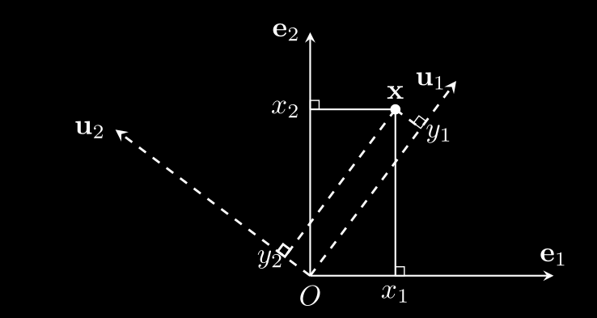
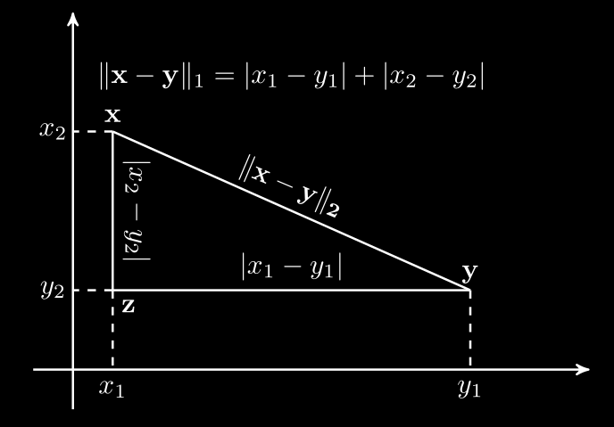

# Đại số tuyến tính cho Machine Learning

<b style="font-size: 170%;">Table of Contents</b>

- [Đại số tuyến tính cho Machine Learning](#đại-số-tuyến-tính-cho-machine-learning)
  - [1.1. Sơ lược về ký hiệu](#11-sơ-lược-về-ký-hiệu)
  - [1.2. Chuyển vị và Hermitian](#12-chuyển-vị-và-hermitian)
  - [1.3. Phép nhân hai ma trận](#13-phép-nhân-hai-ma-trận)
  - [1.4. Ma trận đơn vị và ma trận nghịch đảo](#14-ma-trận-đơn-vị-và-ma-trận-nghịch-đảo)
    - [1.4.1 Ma trận đơn vị](#141-ma-trận-đơn-vị)
    - [1.4.2. Ma trận nghịch đảo](#142-ma-trận-nghịch-đảo)
  - [1.5. Một vài ma trận đặc biệt](#15-một-vài-ma-trận-đặc-biệt)
    - [1.5.1. Ma trận đường chéo](#151-ma-trận-đường-chéo)
    - [1.5.2. Ma trận tam giác](#152-ma-trận-tam-giác)
  - [1.6. Định thức](#16-định-thức)
    - [1.6.1 Định nghĩa](#161-định-nghĩa)
    - [1.6.2. Tính chất](#162-tính-chất)
  - [1.7. Tổ hợp tuyến tính, không gian sinh](#17-tổ-hợp-tuyến-tính-không-gian-sinh)
    - [1.7.1. Tổ hợp tuyến tính](#171-tổ-hợp-tuyến-tính)
    - [1.7.2. Tính chất](#172-tính-chất)
    - [1.7.3. Cơ sở của một không gian](#173-cơ-sở-của-một-không-gian)
    - [1.7.4. Range và Null space](#174-range-và-null-space)
  - [1.8. Hạng của ma trận](#18-hạng-của-ma-trận)
  - [1.9. Hệ trực chuẩn, ma trận trực giao](#19-hệ-trực-chuẩn-ma-trận-trực-giao)
    - [1.9.1. Định nghĩa](#191-định-nghĩa)
    - [1.9.2. Tính chất](#192-tính-chất)
  - [1.10. Biểu diễn vector trong các hệ cơ sở khác nhau](#110-biểu-diễn-vector-trong-các-hệ-cơ-sở-khác-nhau)
  - [1.11. Trị riêng và vector riêng](#111-trị-riêng-và-vector-riêng)
    - [1.11.1. Định nghĩa](#1111-định-nghĩa)
    - [1.11.2. Tính chất](#1112-tính-chất)
  - [1.12. Chéo hóa ma trận](#112-chéo-hóa-ma-trận)
    - [1.12.1. Lưu ý:](#1121-lưu-ý)
  - [1.13. Ma trận xác định dương](#113-ma-trận-xác-định-dương)
  - [1.14. Chuẩn](#114-chuẩn)
    - [Định nghĩa 1.1. Chuẩn - Norm](#định-nghĩa-11-chuẩn---norm)
    - [1.14.1. Một số chuẩn vector thường dùng](#1141-một-số-chuẩn-vector-thường-dùng)
    - [1.14.2. Chuẩn Frobenius của ma trận](#1142-chuẩn-frobenius-của-ma-trận)
  - [1.15. Vết](#115-vết)

## 1.1. Sơ lược về ký hiệu

Các đại lượng vô hướng là các chữ thường in nghiêng vd: $x, y, N$. Các ma trận là chữ viết hoa in đậm vd: $\mathbf{X}, \mathbf{Y}$. Các vector được biểu diễn bởi chữ thường in đậm, mặc định là **vector cột** vd: $\mathbf{x}, \mathbf{y}$.

Lưu ý với vector: $\mathbf{x} = [x_1, x_2, x_3, ..., x_n]$ là vector hàng. Còn $\mathbf{x} = [x_1; x_2;...;x_n]$ là vector cột. Sự khác biệt ở đây là dấu (,) và dấu chấm phẩy.

Tương tự đối với ma trận. $\mathbf{X=[x_1, x_2, ... , x_n]}$ là ma trận mà các vector là cột xếp cạnh nhau từ trái sang phải. Trong khi $\mathbf{X = [x_1;x_2;...;x_n]}$ là ma trận mà các vector là hàng xếp chồng nhau.

Cho một ma trận $\mathbf{W}$, nếu không nói gì thêm thì $\mathbf{w_i}$ là vector cột thứ i của ma trận $\mathbf{W}$.

## 1.2. Chuyển vị và Hermitian

Cho ma trận/vector $\mathbf{A} \in \mathbb{R^{m \times n}}$, thì $\mathbf{B} \in \mathbb{R^{n \times m}}$ là chuyển vị của $\mathbf{A}$ nếu $b_{ij} = a_{ji}, \forall 1 \leq i \leq n, \forall 1 \leq j \leq m$.

$$\begin{gathered}\mathbf{x}=\begin{bmatrix}x_1\\x_2\\\vdots\\x_m\end{bmatrix}\Rightarrow\mathbf{x}^T=\begin{bmatrix}x_1 x_2 \ldots x_m\end{bmatrix};\\\mathbf{A}=\begin{bmatrix}a_{11}&a_{12}&\ldots&a_{1n}\\a_{21}&a_{22}&\ldots&a_{2n}\\\ldots&\ldots&\ddots&\ldots\\a_{m1}&a_{m2}&\ldots&a_{mn}\end{bmatrix}\Rightarrow\mathbf{A}^T=\begin{bmatrix}a_{11}&a_{21}&\ldots&a_{m1}\\a_{12}&a_{22}&\ldots&a_{m2}\\\ldots&\ldots&\ddots&\ldots\\a_{1n}&a_{2n}&\ldots&a_{mn}\end{bmatrix}\end{gathered}$$

Nếu $\mathbf{A}^T = \mathbf{A}$ ta nói $\mathbf{A}$ là ma trận đối xứng.

Trong trường hợp vector hoặc ma trận có số phức, việc lấy chuyển vị thường đi kèm với việc lấy liên hợp phức. Nghĩa là ngoài việc đổi vị trí của các phần tử ta còn lấy liên hợp của các phần tử đó. Tên gọi của phép chuyển vị này còn được gọi là *phép chuyển vị liên hợp* (conjugate transpose), thường được ký hiệu bằng $H$ thay cho $T$. Chuyển vị liên hợp của $\mathbf{A}$ là $\mathbf{A}^H$.

Cho $\mathcal{A}\in\mathbb{C}^{m\times n}$, ta nói $\mathcal{B}\in\mathbb{C}^{n\times m}$ là chuyển vị liên hợp cűa $\mathbf{A}$ nếu $b_{ij}=\overline{a_{ji}},\quad\forall1\leq$ $i\leq n,1\leq j\leq m$, trong đó $\bar{a}$ là liên hiêp phúc cűa $a.$

Ví dụ:

$$\mathbf{A}=\begin{bmatrix}1+2i&3-4i\\i&2\end{bmatrix}\Rightarrow\mathbf{A}^H=\begin{bmatrix}1-2i&-i\\3+4i&2\end{bmatrix}$$

Nếu chuyển vị liên hợp của một ma trận vuông phức bằng với chính nó, $\mathbf{A}^H = \mathbf{A}$ thì ma trận $\mathbf{A}$ gọi là *Hermitian*.

## 1.3. Phép nhân hai ma trận

Cho $\mathbf{A} \in \mathbb{R}^{m \times n}, \mathbf{B} \in \mathbb{R}^{n \times p}$, tích của hai ma trận là $\mathbf{C = AB} \in \mathbb{R}^{m \times p}$. Trong đó mỗi phần tử của $\mathbf{C}$ được tính bởi:

$$c_{ij} = \sum_{k=1}^{n},\ \forall 1 \leq i \leq m, 1 \leq j \leq p$$

Để nhân ma trận thì số cột của ma trận 1 phải bằng số hàng ma trận 2.

Có các tính chất sau:

- Phép nhân ma trận không có tính chất giao hoán.
- Phép nhân ma trận có tính chất kết hợp: $\mathbf{(AB)C=A(BC)=ABC}$
- Phép nhân ma trận có tính phân phối với phép cộng: $\mathbf{A(B+C)=AB + AC}$
- Chuyển vị của tích bằng tích chuyển vị ngược lại: $\mathbf{(AB)^T = B^T A^T}$. Điều này cũng xảy ra với chuyển vị liên hợp.

Tích trong, hay tích vô hướng (inner product) của hai vector $\mathbf{x, y} \in \mathbb{R}^n$ là:

$$\mathbf{x^Ty = y^Tx} = \sum_{i=1}^n x_iy_i$$

Nếu tích vô hướng của hai vector khác không bằng không thì hai vector này *trực giao* (orthogonal).

Phép nhân của một ma trận $\mathbf{A} \in \mathbb{R}^{m \times n}$ và một vector $\mathbf{x} \in \mathbb{R}^n$ là một vector $\mathbf{b} \in \mathbb{R}^m$\

$$\mathbf{Ax=b},\ \text{với } \mathbf{A_{i:}x}$$

Ví dụ:

$$\left[\begin{matrix}
    1\   2 \\
    2\   3
\end{matrix}\right] \times \left[ \begin{matrix}
    2 \\
    2
\end{matrix}\right] = \left[ \begin{matrix}
    6 \\
    10
\end{matrix} \right]$$

Phép nhân từng thành phần gọi là *tích Hadamard*. Là lấy từng phần tử của ma trận 1 nhân với từng phần tử ma trận 2 ký hiệu là $\mathbf{C}=\mathbf{A}\odot\mathbf{B}$.

## 1.4. Ma trận đơn vị và ma trận nghịch đảo

### 1.4.1 Ma trận đơn vị

Đường chéo chính của ma trận là tập hợp các điểm có chỉ số hàng và cột bằng nhau. Nếu $\mathbf{A} \in \mathbb{R}^{m \times n}$ thì đường chéo chính của $\mathbf{A}$ là $\set{a_{11}, a_{22}, ..., a_{pp}}$ với $p = min\{m,n\}$ 

Vậy ma trận đơn vị là ma trận không nhưng có đường chéo chính bằng 1. Ký hiệu $I_n \in \mathbb{R^n}$. Ví dụ: 

$$\mathbf{I}_3=\begin{bmatrix}1 0 0\\0 1 0\\0 0 1\end{bmatrix},\quad\mathbf{I}_4=\begin{bmatrix}1 0 0 0\\0 1 0 0\\0 0 1 0\\0 0 0 1\end{bmatrix}$$

Tính chất đặc biệt $\mathbf{AI} = \mathbf{IA} = \mathbf{A}$

### 1.4.2. Ma trận nghịch đảo

Cho ma trận vuông $\mathbf{A} \in \mathbb{R}^{n \times n}$, ma trận $\mathbf{B} \in \mathbb{R}^{n \times n}$ là ma trận nghịch đảo của $\mathbf{A}$ khi $\mathbf{AB = I_n}$. Lúc đó $\mathbf{A}$ khả nghịch và $\mathbf{B}$ là ma trạn nghịch đảo của $\mathbf{A}$. Nếu không tồn tại ma trận $\mathbf{B}$ thỏa mãn điều trên thì $\mathbf{A}$ không khả nghịch. Ký hiệu $\mathbf{B = A^{-1}}$

Ma trận nghịch đảo dùng để giải hệ phương trình tuyến tính $\mathbf{Ax = b}$. Nếu $\mathbf{A}$ khả nghịch thì $\mathbf{x}$ có nghiệm duy nhất là $\mathbf{A^{-1}b}$.

Nếu $\mathbf{A}$ không khả nghịch, thậm chí không vuông, phương trình tuyến tính trên có thể vô nghiệm hoặc có vô số nghiệm.

Nếu $\mathbf{A,B}$ khả nghịch thì $\mathbf{(AB)^{-1}}=\mathbf{B^{-1}A^{-1}}$.

## 1.5. Một vài ma trận đặc biệt

### 1.5.1. Ma trận đường chéo

Là ma trận mà các thành phần khác không chỉ nằm trên đường chéo chính. Có thể áp dụng lên ma trận không vuông. Ma trận không, ma trận đơn vị là các ma trận đường chéo.

Ký hiệu $diag(a_{11}, a_{22}, ... a_{mm})$ là cho ma trận đường chéo vuông. Tích, tổng của hai ma trận đường chéo vuông cùng bậc là một ma trận đường chéo. Một ma trận đường chéo vuông là khả nghịch khi và chỉ khi mọi phần tử trên đường chéo chính của nó khác không. Nghịch đảo của một ma trận đường chéo khả nghịch cũng là một ma trận đường chéo. Cụ thể $(diag(a_{11}, a_{22}, ... a_{mm}))^{-1} = diag(a_{11}^{-1}, a_{22}^{-1}, ... a_{mm}^{-1})$.

### 1.5.2. Ma trận tam giác

Một ma trận vuông được gọi là ma trận tam giác trên nếu tất cả các thành phần nằm phía dưới đường chéo chính bằng 0. Tương tự, một ma trận vuông được gọi là ma trận tam giác dưới nếu tất cả các thành phần nằm phía trên đường chéo chính bằng 0.

## 1.6. Định thức

### 1.6.1 Định nghĩa

Định thức của một ma trận vuông bậc $n$ $\mathbf{A}$ ký hiệu là $\det(\mathbf{A})$.

Với $n=1$ định thức của ma trận = phần tử duy nhất cua ma trận đó.

Với $n > 1$:

$$\mathbf{A}=\begin{bmatrix}a_{11}&a_{12}&\ldots&a_{1n}\\a_{21}&a_{22}&\ldots&a_{2n}\\\ldots&\ldots&\ddots&\ldots\\a_{n1}&a_{n2}&\ldots&a_{nn}\end{bmatrix}\Rightarrow\det(\mathbf{A})=\sum_{j=1}^n(-1)^{i+j}a_{ij}\det(\mathbf{A}_{ij})$$

Trong đó $\mathbf{A_{ij}}$ là phần bù đại số của $\mathbf{A}$ ứng với phần tử ở hàng $i$, cột $j$. Phần bù đại số này là ma trận con của $\mathbf{A}$ bằng cách bỏ đi hàng $i$, cột $j$ của ma trận $\mathbf{A}$.

### 1.6.2. Tính chất

- det($\mathbf{A}$) = det($\mathbf{A^T}$)
- Định thức của ma trận đường chéo bằng tích các phần tử trên đường chéo chính.
- Định thức của ma trận đơn vị bằng 1.
- Định thức của ma trận tích bằng tích định thức: $det(\mathbf{AB}) = det(\mathbf{A})det(\mathbf{B})$ với $\mathbf{A, B}$ cùng chiều.
- Nếu ma trận có một hàng hoặc một cột là vector không thì định thức bằng không.
- Ma trận khả nghịch khi và chỉ khi định thức khác 0.
- Nếu một ma trận khả nghịch, định thức của ma trận nghịch đảo bẳng nghịch đảo định thức của nó

$$det(\mathbf{A^{-1}}) = \frac{1}{det(\mathbf{A})} \text{ vì } \det(\mathbf{A})\det(\mathbf{A}^{-1})=\det(\mathbf{A}\mathbf{A}^{-1})=\det(\mathbf{I})=1$$ 

## 1.7. Tổ hợp tuyến tính, không gian sinh

### 1.7.1. Tổ hợp tuyến tính

Cho các vector khác không $\mathbf{a_1, ..., a_n} \in \mathbb{R}^{m}$ và các số thực $x_1, \dots, x_n \in \mathbb{R}$, vector:

$$\mathbf{b} = x_1a_1 + x_2a_2 + ... + x_na_n$$

được gọi là một *tổ hợp tuyến tính* của $\mathbf{a_1, ..., a_n}$. Xét ma trận $\mathbf{A} = [\mathbf{a_1, a_2, ..., a_n}] \in \mathbb{R^{m \times n}}$. Biểu thức trên sẽ được viết thành $\mathbf{b=Ax}$. Ta nói $\mathbf{b}$ là một tổ hợp tuyến tính các cột của $\mathbf{A}$.

Tập hợp các vector có thể biểu diễn được dưới dạng tổ hợp tuyến tính của một hệ vector được gọi là *không gian sinh* của hệ vector đó. Không gian sinh của một hệ vector được ký hiệu là $span(\mathbf{a_1, ..., a_n})$. Nếu phương trình:

$$0 = x_1\mathbf{a_1} + ... + x_n\mathbf{a_n}$$

có nghiệm duy nhất $x_1 = x_2 = ... = x_n = 0$ thì hệ $\set{\mathbf{a_1, a_2, ..., a_n}}$ *độc lập tuyến tính*. Ngược lại nếu tồn tại $x_1 \neq 0$ sao cho phương trình trên thỏa mãn thì hệ đó *phụ thuộc tuyến tính*.

### 1.7.2. Tính chất

- Một hệ *phụ thuộc tuyến tính* khi và chỉ khi tồn tại một vector trong hệ đó là tổ hợp tuyến tính của các vector còn lại.
- Tập con khác rỗng của một hệ *độc lập tuyến tính* là một hệ *độc lập tuyến tính*.
- Các cột của ma trận khả nghịch tạo thành một hệ độc lập tuyến tính.

Giả sử ma trận $\mathbf{A}$ khả nghịch, phương trình $\mathbf{Ax = 0}$ có nghiệm duy nhất $\mathbf{x = A^{-1}0 = 0}$. Vậy $\mathbf{A}$ là hệ độc lập tuyến tính.

- Nếu $\mathbf{A}$ là ma trận cao, nghĩa là số hàng nhiều hơn số cột, $m > n$, tồn tại vector $\mathbf{b}$ sao cho phương trình $\mathbf{Ax=b}$ vô nghiệm.
- Nếu $n > m$, $n$ vector bất kỳ trong không gian $m$ chiều tạo thành một hệ phụ thuộc tuyến tính.

### 1.7.3. Cơ sở của một không gian

Một hệ các vector $\set{\mathbf{a_1, ..., a_n}}$ trong không gian vector $m$ chiều $V = \mathbb{R}^m$ được gọi là một cơ sở nếu hai điều kiện sau thỏa mãn:

- $V = span(\mathbf{a_1, ..., a_n})$
- $\set{\mathbf{a_1, a_2, ..., a_n}}$

Khi đó, mọi vector $\mathbf{b} \in V$ đều có thể biểu diễn duy nhất dưới dạng tổ hợp tuyến tính của các $\mathbf{a_i}$. Từ hai tính chất cuối ở mục 1.7.2, ta có thể suy ra rằng $m = n$.

### 1.7.4. Range và Null space

Với mỗi $\mathbf{A} \in \mathbb{R}^{m \times n}$, có hai không gian con quan trọng ứng với ma trận này.

*Range* của $\mathbf{A}$, ký hiệu $\mathcal{R}(\mathbf{A})$, được định nghĩa bởi

$$\mathcal{R}(\mathbf{A}) = \set{\mathbf{y} \in \mathbb{R}^m : \exists \mathbf{x} \in \mathbb{R}^n, \mathbf{Ax=y}}$$

$\mathcal{R}(\mathbf{A})$ là không gian sinh của các cột của $\mathbf{A}$. $\mathcal{R}(\mathbf{A})$ là một không gian con của $\mathbb{R}^n$ với số chiều bằng số lớn nhất của các cột độc lập tuyến tính của $\mathbf{A}$.

*Null* của $\mathbf{A}$, ký hiệu $\mathcal{N}(\mathbf{A})$, được định nghĩa bởi

$$\mathcal{N}(\mathbf{A}) = \set{\mathbf{x} \in \mathbb{R}^n : \mathbf{Ax=0}}$$

Mỗi vector trong $\mathcal{N}(\mathbf{A})$ tương ứng với bộ các hệ số làm cho tổ hợp tuyến tính các cột của $\mathbf{A}$ bằng vector 0. 

Có 

$$dim(\mathcal{R}(\mathbf{A})) + dim(\mathcal{N}(\mathbf{A})) = n$$

## 1.8. Hạng của ma trận

Hạng của ma trận $\mathbf{A} \in \mathbb{R}^{m \times n}$, ký hiệu là $rank(\mathbf{A})$, được định nghĩa là số lượng lớn nhất các cột của nó tạo thành một hệ độc lập tuyến tính. (số cột khác không)

Một số tính chất quan trọng của hạng

- Một ma trận có hạng bằng 0 khi và chỉ khi đó là ma trận không.
- Hạng của ma trận bằng hạng của ma trận chuyển vị. $rank(\mathbf{A}) = rank(\mathbf{A^T})$.
- Hạng của ma trận không lớn hơn số hàng hoặc số cột. Nếu $\mathbf{A} \in \mathbb{R}^{n \times m}$ thì $rank(\mathbf{A}) \leq min(m,n)$.
- Hạng của một tích không vượt quá hạng của một nhân tử. $rank(\mathbf{AB}) \leq min(rank(\mathbf{A}), rank(\mathbf{B}))$.
- Hạng của tổng không vượt quá tổng các hạng. $rank(\mathbf{A + B}) \leq rank(\mathbf{A}) + rank(\mathbf{B})$.

## 1.9. Hệ trực chuẩn, ma trận trực giao

### 1.9.1. Định nghĩa

Một hệ cơ sở $\mathbf{\set{u_1, u_2, ..., u_m}} \in \mathbb{R}^m$ được gọi là *trực giao* nếu mỗi vector khác không và tích vô hướng của hai vector khác nhau bất kỳ bằng không.

$$\mathbf{u_i \neq 0}; \mathbf{u_i^Tu_j = 0} \forall 1 \leq i \neq j \leq m$$

Một hệ cơ sở $\mathbf{\set{u_1, u_2, ..., u_m}} \in \mathbb{R}^m$ được gọi là *trực chuẩn* nếu nó là một hệ *trực giao* và độ dài **Euclid** của mọi vector bằng 1.

$$\mathbf{u}_i^T\mathbf{u}_j=\left\{\begin{array}{l}1\text{ nếu }i=j\\0\text{ nếu }i\neq j\end{array}\right.$$

Nếu $\mathbf{U = [u_1, u_2, ..., u_m]}$ với $\set{u_1, u_2, ..., u_m} \in \mathbb{R}^m$ là *trực chuẩn* thì:

$$\mathbf{UU}^T=\mathbf{U}^T\mathbf{U}=\mathbf{I}$$

Nếu một ma trận thỏa điều kiện trên thì ma trận đó gọi là *ma trận trực giao*. Không có định nghĩa cho ma trận trực chuẩn.

Nếu một ma trận vuông phức $\mathbf{U}$ thỏa $\mathbf{UU^H = U^HU = I}$ thì ma trận $\mathbf{U}$ gọi là ma trận *unitary*. 

### 1.9.2. Tính chất

- Nghịch đảo của ma trận *trực giao* chính là chuyển vị của nó:

$$\mathbf{U^{-1} = U^T}$$

- Nếu $\mathbf{U}$ là một ma trận *trực giao* thì chuyển vị của nó cũng la ma trận trực giao.
- Định thức của ma trận *trực giao* bằng 1 hoặc -1.
- Ma trận *trực giao* thể  hiện phép xoay một vector.

Cho hai vector $\mathbf{x, y} \in \mathbb{R}^m$ và một ma trận trực giao $\mathbf{U} \in \mathbb{R}^{m \times m}$. Dùng ma trận này để xoay hai vector trên thì được $\mathbf{Ux, Uy}$. Tích vô hướng mới của hai vector là:

$$(\mathbf{Ux})^T(\mathbf{Uy})=\mathbf{x}^T\mathbf{U}^T\mathbf{Uy}=\mathbf{x}^T\mathbf{y}$$

như vậy phép xoay không làm thay đổi tích vô hướng giữa hai vector.

## 1.10. Biểu diễn vector trong các hệ cơ sở khác nhau

Trong không gian $m$ chiều, tọa độ của mỗi điểm được xác định dựa trên một hệ tọa độ nào đó. Ở các hệ tọa độ khác nhau, tọa độ của mỗi điểm cũng khác nhau.

Tập hợp các vector $\mathbf{e_1, ..., e_m}$ nếu mỗi vector $\mathbf{e_i}$ chỉ có đúng một phần tử khác không ở vị trí $i$ và phần tử đó bằng $1$. Thì hệ này các vector này gọi là *hệ cơ sở đơn vị (hoặc chính tắc)*. Nếu sắp xếp các vector này theo thứ tự cạnh nhau ta được ma trận đơn vị.

Mỗi vector cột $\mathbf{x} = [x_1,x_2,x_3,...,x_m] \in \mathbb{R}^m$ có thể được coi là tổ hợp tuyến tính của các vector trong hệ cơ sở chính tắc:

$$\mathbf{x}=x_1\mathbf{e}_1+x_2\mathbf{e}_2+\cdots+x_m\mathbf{e}_m$$

Giả sử có một hệ cơ sở độc lập tuyến tính khác $\mathbf{u_1, u_2, ..., u_m}$. Trong hệ cơ sở mới này, $\mathbf{x}$ được viết dưới dạng

$$\mathbf{x}= y_1\mathbf{u_1} + y2\mathbf{u_2} + ... + y_m\mathbf{u_m} = \mathbf{Uy}$$

**Hình 1.1.** Chuyển đổi tọa độ trong hệ cơ sở khác nhau. Trong hệ $(O\mathbf{e_1e_2}), \mathbf{x}$ có tọa độ $(x_1,x_2)$. Trong hệ $(O\mathbf{u_1u_2}), \mathbf{x}$ có tọa độ $(y_1,y_2)$.

Với $\displaystyle\mathbf{U = [u_1, ..., u_m]}$. Lúc này vector $\displaystyle\mathbf{y} = [y_1, ..., y_m]^T$ chính là biểu diễn của $\mathbf{x}$ trong hệ cơ sở $\mathbf{U}$. Biểu diễn này là duy nhất.

Trong các ma trận vuông đóng vai trò như hệ cơ sở, ma trận trực giao được quan tâm nhiều hơn vì nghịch đảo của nó bằng chuyển vị của nó. Khi đó $\mathbf{y = U^Tx}$. Suy ra $y_i = \mathbf{x^Tu_i = u_i^Tx}$. Dưới góc nhìn hình học, hệ trực giao tạo thành hệ Descartes vuông góc.

Vector không được biểu diễn như nhau trong mọi hệ cơ sở.

## 1.11. Trị riêng và vector riêng

### 1.11.1. Định nghĩa

Cho một ma trận vuông $\mathbf{A} \in \mathbb{R}^{n\times n}$, một vector $\mathbf{x} \in \mathbb{C}^{n} \neq \mathbf{0}$ và một số vô hướng $\lambda \in \mathbb{C}$. Nếu

$$\mathbf{Ax}=\lambda\mathbf{x}$$

Thì $\lambda$ là trị riêng của $\mathbf{A}$ và $\mathbf{x}$ là vector riêng ứng với trị riêng $\lambda$.

Từ định nghĩa ta có $(\mathbf{A}-\lambda\mathbf{I})\mathbf{x}=0$, tức $\mathbf{x}$ nằm trong không gian $\mathcal{N}(\mathbf{A-\lambda I})$. Vì $\mathbf{x \neq 0}$ nên ma trận $\mathbf{A - \lambda I}$ là ma trận không khả nghịch hay $det(\mathbf{A - \lambda I}) = 0$. Vậy giải ra tìm được $\lambda$ là nghiệm của định thức bằng không. Tập hợp tất cả trị riêng được gọi là *phổ* của ma trận $\mathbf{A}$.

Cách tìm vector riêng: Thay lần lượt các trị riêng $\lambda$ vào $\mathbf{(A - \lambda I)x=0}$ giải hệ phương trình tìm được $\mathbf{x}$ là vector riêng ứng với trị riêng $\lambda$.

Ví dụ:

Xét ma trận:

$$\mathbf{A} = \left[\begin{matrix}3&5 \\ 0&7\end{matrix}\right]$$

Ta tìm các trị riêng bằng cách giải phương trình:

$$det(\mathbf{A-\lambda I}) = 0$$

Tìm được $\lambda_1 = 3$ và $\lambda_2 = 7$.

Ta tìm các vector riêng ứng với các trị riêng:

Với $\lambda_1 = 3$, giải hệ phương trình:

$$\left[\begin{array}{cc}0&5\\0&4\end{array}\right]\left[\begin{array}{c}x_1\\x_2\end{array}\right]=\left[\begin{array}{c}0\\0\end{array}\right].$$

Ta có nghiệm khác không $\mathbf{x_1} = [1, 0]^T$

Với $\lambda_2 = 7$, giải hệ phương trình:

$$\left[\begin{array}{cc}-4&5\\0&0\end{array}\right]\left[\begin{array}{c}x_3\\x_4\end{array}\right]=\left[\begin{array}{c}0\\0\end{array}\right].$$

Ta có nghiệm khác không $\mathbf{x_2} = [5, 4]^T$

### 1.11.2. Tính chất

- Nếu $\lambda$ là một trị riêng của $\mathbf{A}$, đặt $E_\lambda (\mathbf{A})$ là tập các vector riêng ứng với trị riêng $\lambda$ đó thì:
  - Nếu $\mathbf{x} \in E_\lambda (\mathbf{A})$ thì $k\mathbf{x} \in E_\lambda (\mathbf{A}), \forall k \in \mathbb{C}$
  - Nếu $\mathbf{x_1, x_2} \in E_\lambda (\mathbf{A})$ thì $\mathbf{x_1 + x_2} \in E_\lambda (\mathbf{A})$
- Mọi ma trận vuông bậc $n$ đều có $n$ trị riêng.
- Tích của tất cả trị riêng của một ma trận bằng định thức của ma trận đó. Tổng tất cả trị riêng của một ma trận bằng tổng các phần tử trên đường chéo chính của ma trận đó.
- Phổ của ma trận bằng phổ của ma trận chuyển vị của nó.
- Tất cả trị riêng của ma trận *Hermitian* là các số thực.
- Nếu $(\lambda, \mathbf{x})$ là một cặp trị riêng, vector riêng của ma trận khả nghịch $\mathbf{A}$ thì $\displaystyle(\frac{1}{\lambda}, \mathbf{x})$ là một cặp trị riêng và vector riêng của $\mathbf{A^{-1}}$.

## 1.12. Chéo hóa ma trận

Phân tích ma trận thành tích của các ma trận đặc biệt mang lại nhiều lợi ích trong việc giải hệ phương trình tuyến tính, tính lũy thừa, xấp xĩ ma trận,... 

Giả sử $\mathbf{x_1, ..., x_n \neq 0}$ là các vector riêng của một ma trận vuông $\mathbf{A}$ ứng với các trị riêng lặp hoặc phức $\lambda_1, ..., \lambda_n$.

Đặt $\boldsymbol{\Lambda}=\operatorname{diag}(\lambda_1,\lambda_2,\ldots,\lambda_n)$ và $\mathbf{X=[x_1, x_2, ..., x_n]}$, ta sẽ có $\mathbf{AX = X\boldsymbol{\Lambda}}$. Hơn nữa nếu các vector riêng $\mathbf{x_1, ..., x_n}$ độc lập tuyến tính, ma trận $\mathbf{X}$ là một ma trận khả nghịch. Khi đó ta viết $\mathbf{A}$ có dạng:

$$\mathbf{A = X\boldsymbol{\Lambda}X^{-1}}$$

Các vector riêng $\mathbf{x_i}$ thường được chọn sao cho $\mathbf{x_i^Tx_i} =1$. Cách biểu diễn trên được gọi là phép phân tích trị riêng.

Ma trận các trị riêng $\boldsymbol{\Lambda}$ là ma trận đường chéo. Vì vậy cách triển khai này có tên gọi là chéo hóa ma trận. Nếu ma trận $\mathbf{A}$ có thể được phân tích như trên thì ta nói $\mathbf{A}$ chéo hóa được.

### 1.12.1. Lưu ý:

- Khái niệm chéo hóa ma trận chỉ áp dụng với ma trận vuông.
- Không phải ma trận vuông nào cũng chéo hóa được. Một ma trận vuông bậc $n$ chéo hóa được khi và chỉ khi nó có đủ $n$ vector riêng độc lập tuyến tính.
- Nếu ma trận chéo hóa được, có nhiều hơn một cách chéo hóa ma trận đó. Chỉ cần đổi vị trí của $\lambda_i$ và vị trí tương ứng của cột $\mathbf{x_i}$ của $\mathbf{X}$, ta có cách chéo hóa mới.
- Nếu $\mathbf{A}$ chéo hóa được thì lũy thừa của nó cũng chéo hóa được. Cụ thể:

$$\mathbf{A}^2=(\mathbf{X}\boldsymbol{\Lambda}\mathbf{X}^{-1})(\mathbf{X}\boldsymbol{\Lambda}\mathbf{X}^{-1})=\mathbf{X}\boldsymbol{\Lambda}^2\mathbf{X}^{-1};\quad\mathbf{A}^k=\mathbf{X}\boldsymbol{\Lambda}^k\mathbf{X}^{-1},\quad\forall k\in\mathbb{N}$$

- Nếu $\mathbf{A}$ khả nghịch, thì $\mathbf{A^{-1} = (X\boldsymbol{\Lambda}X^{-1})^{-1} = X\boldsymbol{\Lambda}^{-1}X^{-1}}$

## 1.13. Ma trận xác định dương

Một ma trận **đối xứng** $\mathbf{A} \in \mathbb{R}^{n \times n}$ được gọi là *xác định dương* nếu:

$$\mathbf{x}^T\mathbf{A}\mathbf{x}>0,\forall\mathbf{x}\in\mathbb{R}^n,\mathbf{x}\neq\mathbf{0}.$$

Một ma trận **đối xứng**  $\mathbf{A} \in \mathbb{R}^{n \times n}$ được gọi là *nửa xác định dương* nếu:

$$\mathbf{x}^T\mathbf{A}\mathbf{x}\geq0,\forall\mathbf{x}\in\mathbb{R}^n,\mathbf{x}\neq\mathbf{0}.$$

Định nghĩa tương tự với *xác định âm* và *nửa xác định âm*.

Ký hiệu $\mathbf{A}\succ0,\succeq0,\prec0,\preceq0$ lân lượt để chỉ một ma trận là xác định dương, nửa xác định dương, xác định âm, và nửa xác định âm. Ký hiệu $\mathcal{A}\succ\mathcal{B}$ cũng được dùng để chỉ ra rằng $\mathrm{A- B\succ 0.}$

## 1.14. Chuẩn

Trong không gian một chiều, khoảng cách giữa hai điểm là trị tuyệt đối của hiệu hai giá trị đó. Trong không gian hai chiều, ta thường dùng khoảng cách Euclid để đo khoảng cách giữa hai điểm. Đôi khi, để đi từ điểm này sang điểm kia, chúng ta không thể đi bằng một đường thẳng và còn phụ thuộc vào hình dạng đường đi nối giữa hai điểm.

Việc đo khoảng cách hai điểm dữ liệu rất cần thiết trong machine learning. Đây là lí do khái niệm *chuẩn* (norm) ra đời. Để xác định khoảng cách giữa hai vector $\mathbf{y}$ và $\mathbf{z}$, người ta áp dụng một hàm số lên vector hiệu $\mathbf{x = y - z}$. Hàm số này có vài tính chất đặc biệt:

### Định nghĩa 1.1. Chuẩn - Norm

Một hàm số $f:\mathbb{R}^n \to \mathbb{R}$ được gọi là một chuẩn nếu nó thỏa mãn ba điều kiện sau:
- $f(\mathbf{x}) \geq 0$. Dấu bằng xảy ra khi và chỉ khi $\mathbf{x = 0}$.
- $f(\alpha\mathbf{x}) = |\alpha| f(\mathbf{x}),\ \forall \alpha \in \mathbb{R}$.
- $f(\mathbf{x_1}) + f(\mathbf{x_2}) \geq f(\mathbf{x_1 + x_2})$.

### 1.14.1. Một số chuẩn vector thường dùng

Độ dài Euclid của một vector $\mathbf{x} \in \mathbb{R}^n$ chính là một chuẩn, chuẩn này gọi là $\ell_{2}$ hay chuẩn Euclid:

$$||\mathbf{x}||_2 = \sqrt{x_1^2 + x_2^2 + ... + x_n^2}$$

Bình phương của chuẩn $\ell_{2}$ chính là tích vô hướng của một vector với chính nó, $||\mathbf{x}||_2^2 = \mathbf{x^Tx}$

Hình 1.2. Minh họa chuẩn $\ell_{1}$ và $\ell_{2}$ trong không gian hai chiều. Chuẩn $\ell_{2}$ là khoảng cách Euclid còn chuẩn $\ell_{1}$ là quãng đường ngắn nhất giữa hai điểm nếu chỉ được đi song song với các trục tọa độ.

Với $p$ là số không nhỏ hơn 1 bất kỳ hàm số:

$$\|\mathbf{x}\|_p=(|x_1|^p+|x_2|^p+\ldots|x_n|^p)^{\frac1p}$$

được gọi là chuẩn $\ell_p$.

Một vài giá trị $p$ thường hay dùng:

- Khi $p=2$, ta có chuẩn như ở trên.
- Khi $p=1$, ta có chuẩn $||\mathbf{x}||_1 = |x_1| + |x_2| + ... + |x_n|$ là tổng các trị tuyệt đối của từng thành phần của vector.
- Khi $p \to \infty$, giả sử $i=\arg\max_{j=1,2,...,n}|x_j|$. Khi đó:

$$\|\mathbf{x}\|_p=|x_i|\left(1+\left|\frac{x_1}{x_i}\right|^p+\cdots+\left|\frac{x_{i-1}}{x_i}\right|^p+\left|\frac{x_{i+1}}{x_i}\right|^p+\cdots+\left|\frac{x_n}{x_i}\right|^p\right)^{\frac1p}$$

Ta thấy rằng

$$\lim_{p\to\infty}\left(1+\left|\frac{x_1}{x_i}\right|^p+\cdots+\left|\frac{x_{i-1}}{x_i}\right|^p+\left|\frac{x_{i+1}}{x_i}\right|^p+\cdots+\left|\frac{x_n}{x_i}\right|^p\right)^{\frac1p}=1$$

vì đại lượng trong dấu ngoặc đơn không quá $n$. Ta có:

$$\|\mathbf{x}\|_\infty\triangleq\lim_{p\to\infty}\|\mathbf{x}\|_p=|x_i|=\max_{j=1,2,...,n}|x_j|$$

### 1.14.2. Chuẩn Frobenius của ma trận

Với một ma trận $\mathbf{A} \in \mathbb{R}^{m \times n}$, chuẩn thường được sử dụng nhất là chuẩn Frobenius, ký hiệu là $||\mathbf{A}||_F$, là căn bậc hai của tổng bình phương tất cả phần tử của nó:

$$||\mathbf{A}||_F = \sqrt{\sum_{i=1}^m \sum_{j=1}^n a_{ij}^2}$$

Chuẩn $\ell_2$ (khó) cũng có thể sử dụng cho ma trận nhưng không phổ biến bằng chuẩn Frobenius.

## 1.15. Vết

*Vết*(trace) của một ma trận vuông $\mathbf{A}$ được ký hiệu là $trace(\mathbf{A})$, là tổng các phần tử trên đường chéo chính của nó. Hàm vết xác định trên tập các ma trận vuông được sử dụng nhiều trong tối ưu vì nó có những tính chất đẹp.

Các tính chất quan trọng của hàm vết, với giả sử rằng các ma trận trong hàm vết là vuông và các phép nhân ma trận thực hiện được:

- Một ma trận vuông bất kỳ và chuyển vị của nó có vết bằng nhau: $trace(\mathbf{A}) = trace(\mathbf{A^T})$. Suy ra việc chuyển vị không làm thay đổi phần tử trên đường chéo chính.
- Vết của một tổng bằng tổng vết: $trace(\sum_{i=1}^k \mathbf{A_i})=\sum_{i=1}^k trace(\mathbf{A_i})$
- $trace(k\mathbf{A}) = k trace(\mathbf{A}), \forall k \in \mathbb{R}$
- $trace(\mathbf{AB}) = trace(\mathbf{BA})$.
- $trace(\mathbf{ABC}) = trace(\mathbf{BCA})$ nhưng không bằng $trace(\mathbf{ACB})$.
- Nếu $\mathbf{X}$ khả nghịch thì cùng chiều với $\mathbf{A}$ thì 

$$\mathrm{trace}(\mathbf{XAX}^{-1})=\mathrm{trace}(\mathbf{X}^{-1}\mathbf{XA})=\mathrm{trace}(\mathbf{A})$$

- $||\mathbf{A}||_F^2 = trace(\mathbf{A^TA}) = trace(\mathbf{AA^T})$ với $\mathbf{A}$ là ma trận bất kỳ. Từ đây cũng suy ra $trace(\mathbf{AA^T}) \geq 0$ với mọi ma trận $\mathbf{A}$.