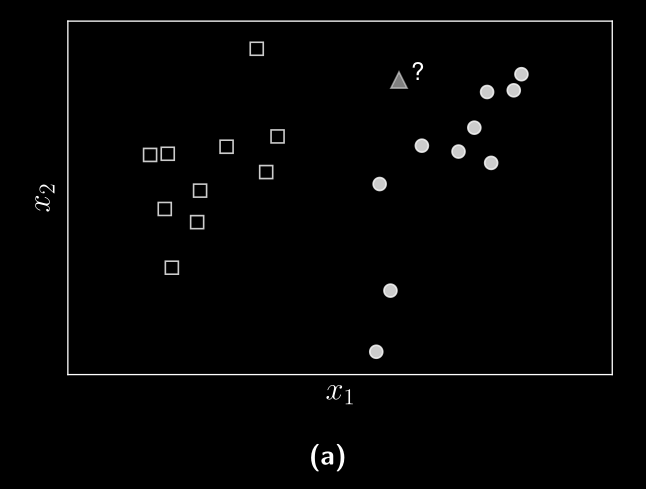
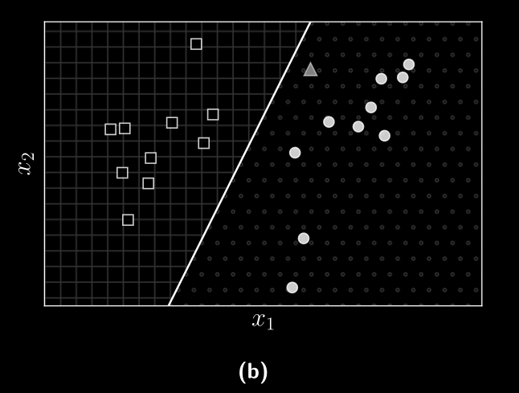
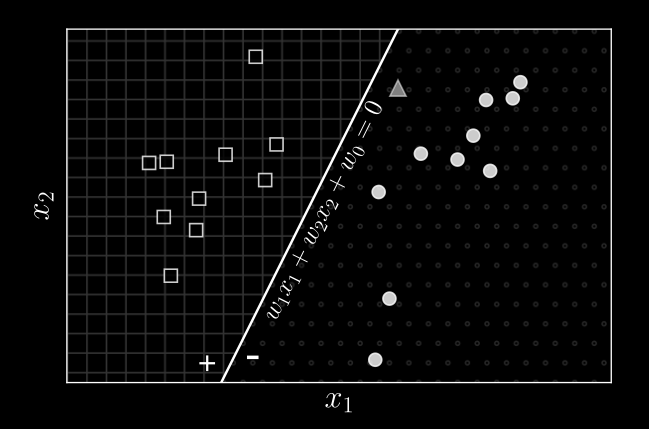
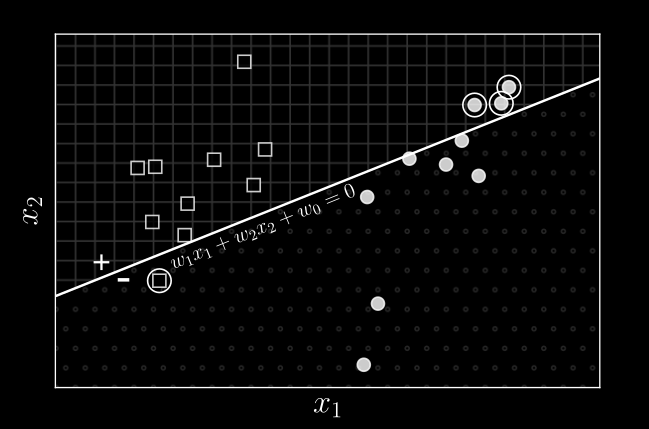

# Thuật toán học perceptron

## 13.1. Giới thiệu

Một trong những thuật toán đầu tiên của Machine Learning. Đây là một phương pháp phân loại đơn giản có tên là *thuật toán học perceptron*. Được thiết kế cho bài toán phân loại nhị phân.

Cho hai tập dữ liệu hình vuông và tròn như Hình 13.1a. Bài toán đặt ra là từ dữ liệu của hai tập được gán nhãn cho trước, hãy xây dựng một bộ phân loại có khả năng dự đoán nhãn của một điểm dữ liệu mới, ví dụ như hình tam giác màu xám.

Nếu coi mỗi vector đặc trưng là một điểm trong không gian nhiều chiều, bài toán phân loại là bài toán xác định nhãn của từng điểm trong không gian. Nếu mỗi nhãn chiếm một hoặc một vài vùng trong không gian, ta cần đi tìm **ranh giới** của các vùng đó. 

Ranh giới đơn giản nhất trong không gian hai chiều là một đường thẳng, ba chiều là mặt phẳng, nhiều chiều là một *siêu phẳng*. Chúng đơn giản vì có thể biểu diễn bởi một hàm số tuyến tính. Hình 13.1b minh họa đường thẳng chia hai tập dữ liệu trong không gian hai chiều. Trong trường hợp này hình tam giác được chia vào nhóm hình tròn.

PLA (Perceptron Learning Algorithm) là thuật toán đơn giản tìm ranh giới siêu phẳng cho bài toán phân loại nhị phân trong tường hợp tồn tại siêu phẳng đó. Nếu hai tập dữ liệu có thể được chia hoàn toàn bằng một siêu phẳng, ta nói chúng *tách biệt tuyến tính*.

## 13.2. Thuật toán học perceptron

### 13.2.1. Quy tắc phân loại

Giả sử xét $\mathbf{X = [x_1, x_2, ... x_N]} \in \mathbb{R}^{d \times N}$ với mỗi cột $\mathbf{x_i}$ là một điểm dữ liệu trong không gian $d$ chiều. Các nhãn được lưu vào vector hàng $\mathbf{y} = [y_1, y_2, ..., y_N] \in \mathbb{R}^{1 \times N}$ với $y_i = 1$ nếu $\mathbf{x_i}$ mang nhãn vuông và $y_i = -1$ nếu $\mathbf{x_i}$ mang nhãn tròn.

Tại một thời điểm, giả sử ranh giới là một siêu phẳng có phương trình

$$f_{\mathbf{w(x)}} = w_1x_1 + ... + w_dx_d + w_0 = \mathbf{x^Tw} + w_0$$

với $\mathbf{w} \in \mathbb{R}^d$ là vector trọng số và $w_0$ là hệ số điều chỉnh. Bằng cách sử dụng thủ thuật gộp hệ số điều chỉnh, ta có thể coi phương trình siêu phẳng là $f_{\mathbf{w(x)}} = \mathbf{x^Tw = 0}$ với $\mathbf{x}$ được hiểu là vector đặc trưng mở rộng thêm một đặc trưng bằng một. Vector trọng số $\mathbf{w}$ là vector pháp tuyến của siêu phẳng $\mathbf{x^Tw} = 0$.

Trong không gian hai chiều giả sử đường thẳng $w_1x_1 + w_2x_2 + w_0 = 0$ là nghiệm cần tìm như hình 13.2a. Ta thấy rằng các điểm nằm cùng phía so với đường thẳng làm cho hàm số $f_{\mathbf{w(x)}}$ mang cùng dấu. Nếu cần thiết có thể đổi dấu của $\mathbf{w}$ để các điểm trên nửa mặt phẳng nền kẻ ô vuông mang dấu dương $(+)$, các điểm trên nửa mặt phẳng nền chấm mang dấu âm $(-)$. Các dấu này tương đương với nhãn $y$ của mỗi điểm dữ liệu. Vậy nếu $\mathbf{w}$ là nghiệm của bài toán thì nhãn của một điểm dữ liệu $\mathbf{x}$ có thể được xác định:

$$label(x) = \begin{cases}
    1&\text{Nếu } \mathbf{x^Tw \geq 0} \\
    -1&\text{Trường hợp còn lại}
\end{cases}$$

Ở hình 13.2a đường thẳng phân chia không gây ra lỗi , mọi điểm được phân loại đúng.

Ở hình 13.2b đường thẳng phân chia gây ra lỗi tại các điểm được khoanh tròn.

Vậy $label(\mathbf{x}) = sgn(\mathbf{x^Tw})$.